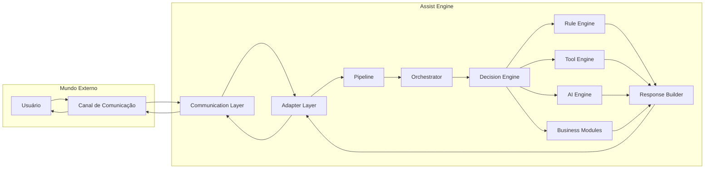
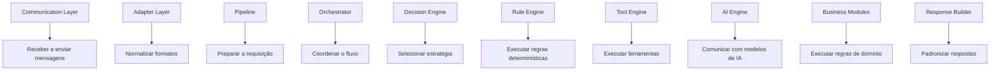
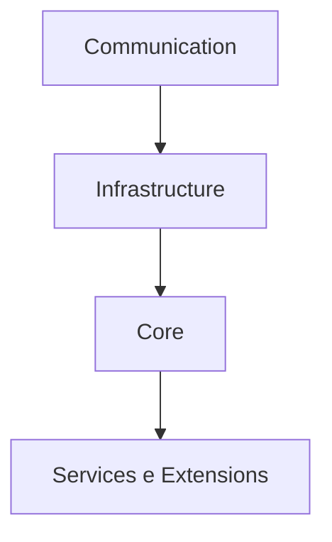

# Component Overview

**Versão:** 1.0

**Status:** Estável

---

# 1. Objetivo

Este documento apresenta uma visão geral dos componentes que compõem a arquitetura do Assist Engine.

Seu objetivo é demonstrar como cada componente participa do processamento de uma requisição e quais são suas responsabilidades dentro do sistema.

Os documentos individuais desta seção aprofundam o funcionamento de cada componente. Este documento, por sua vez, fornece uma visão arquitetural integrada, servindo como ponto de partida para compreensão do Core do Assist Engine.

---

# 2. Visão Geral da Arquitetura

O Assist Engine é organizado como um conjunto de componentes especializados, onde cada elemento possui uma responsabilidade única e bem definida.

Nenhum componente é responsável por executar todas as etapas do processamento.

Ao invés disso, cada um contribui com uma pequena parte do fluxo, permitindo que o sistema permaneça modular, desacoplado e facilmente evolutivo.

Essa divisão reduz a complexidade do Core e favorece a manutenção da arquitetura ao longo do tempo.

---

# 3. Visão Geral dos Componentes

O fluxo apresentado representa a estrutura arquitetural permanente do Assist Engine.

Independentemente do canal de comunicação, do domínio da aplicação ou do provedor de Inteligência Artificial utilizado, toda requisição percorre essa mesma organização.

---

# 4. Categorias de Componentes

Os componentes do Assist Engine estão organizados conforme seu papel dentro da arquitetura.

## Infraestrutura

Os componentes de infraestrutura fazem a integração entre o Assist Engine e o ambiente externo.

Eles conhecem tecnologias específicas, protocolos de comunicação e formatos utilizados pelos canais, mas não possuem conhecimento sobre regras de negócio ou Inteligência Artificial.

Componentes:

* Communication Layer
* Adapter Layer
* Pipeline

---

## Core

O Core representa o núcleo arquitetural do Assist Engine.

É responsável por coordenar o processamento das requisições, selecionar estratégias de execução e garantir que os princípios arquiteturais sejam respeitados.

O Core não depende de tecnologias específicas nem conhece detalhes dos canais de comunicação.

Componentes:

* Orchestrator
* Decision Engine
* Rule Engine
* Response Builder

---

## Serviços

Os serviços executam capacidades especializadas disponibilizadas ao Core.

São acionados somente quando selecionados pelo Decision Engine e permanecem independentes entre si.

Componentes:

* Tool Engine
* AI Engine

---

## Extensões

As extensões representam funcionalidades específicas de um domínio de negócio.

Elas permitem reutilizar o Assist Engine em diferentes aplicações sem alterar o Core.

Componentes:

* Business Modules

---

# 5. Fluxo de Responsabilidades

Cada componente possui exatamente uma responsabilidade principal.

Essa responsabilidade nunca deve ser compartilhada com outro componente.

Essa distribuição de responsabilidades é um dos principais mecanismos utilizados para manter baixo acoplamento e alta coesão entre os componentes.

---

# 6. Relação entre os Componentes

Os componentes não formam uma cadeia de dependências diretas.

Eles colaboram entre si por meio de contratos arquiteturais, preservando a independência entre suas implementações.

Como princípio geral:

* componentes de infraestrutura não conhecem regras de negócio;
* o Core não conhece canais de comunicação;
* serviços não conhecem plataformas externas diretamente;
* módulos de negócio não conhecem detalhes do funcionamento interno do Core.

Essa separação permite substituir implementações sem alterar a arquitetura.

---

# 7. Hierarquia Arquitetural

A arquitetura do Assist Engine pode ser representada em quatro níveis de abstração.

Cada nível adiciona responsabilidades sem aumentar o acoplamento entre os demais.

Essa organização torna a arquitetura previsível e facilita sua evolução incremental.

---

# 8. Princípios que Regem os Componentes

Todos os componentes descritos nesta documentação seguem os mesmos princípios arquiteturais.

* Responsabilidade única.
* Baixo acoplamento.
* Alta coesão.
* Comunicação por contratos.
* Independência tecnológica.
* Independência dos canais de comunicação.
* Independência dos provedores de IA.
* Fluxo único de processamento.
* Estratégia única de execução por requisição.
* Evolução incremental da arquitetura.

Esses princípios possuem caráter normativo e devem ser respeitados por qualquer implementação do Assist Engine.

---

# 9. Navegação da Documentação

Os próximos documentos detalham individualmente cada componente apresentado neste Overview.

A leitura recomendada segue a mesma ordem utilizada durante o processamento de uma requisição.

1. Communication Layer
2. Adapter Layer
3. Pipeline
4. Orchestrator
5. Decision Engine
6. Rule Engine
7. Tool Engine
8. AI Engine
9. Business Modules
10. Response Builder
11. Dependencies
12. Architecture Rules

Essa sequência acompanha o fluxo arquitetural do Assist Engine e facilita a compreensão gradual de suas responsabilidades.

---

# 10. Considerações Finais

O Assist Engine foi projetado como um conjunto de componentes especializados que colaboram para processar requisições de forma consistente, previsível e desacoplada.

Cada componente existe para resolver um único problema arquitetural e comunica-se com os demais exclusivamente por meio de responsabilidades claramente definidas.

Essa organização permite que novas funcionalidades sejam incorporadas ao sistema preservando os princípios estabelecidos na Architecture v1.0, garantindo que a evolução da implementação não comprometa a estabilidade da arquitetura.
