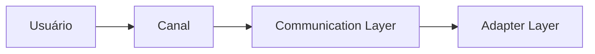
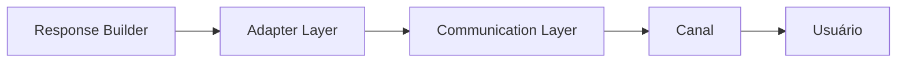
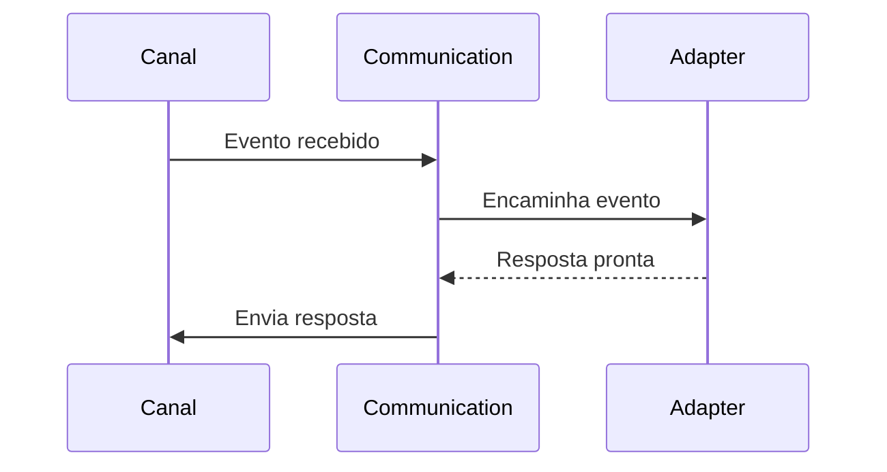

# Communication Layer

**Versão:** 1.0

**Status:** Estável

---

# Resumo

| Item          | Valor                     |
| ------------- | ------------------------- |
| Categoria     | Infraestrutura            |
| Tipo          | Componente                |
| Estado        | Estável                   |
| Introduzido   | Architecture v1.0         |
| Depende de    | Nenhum componente do Core |
| Utilizado por | Adapter Layer             |

---

# 1. Objetivo

A Communication Layer representa a fronteira entre o Assist Engine e o mundo externo.

Sua responsabilidade é receber eventos provenientes dos canais de comunicação suportados e enviar respostas produzidas pelo Assist Engine de volta a esses mesmos canais.

Essa camada isola completamente o Core das particularidades de cada plataforma, garantindo que a arquitetura permaneça independente de protocolos, bibliotecas e APIs externas.

---

# 2. Papel na Arquitetura

Dentro do fluxo arquitetural, a Communication Layer é sempre o primeiro e o último componente executado durante uma requisição.

No retorno da resposta, o fluxo ocorre no sentido inverso.

A Communication Layer nunca participa do processamento interno da solicitação.

Sua única função é intermediar a comunicação entre o ambiente externo e o Assist Engine.

---

# 3. Responsabilidades

Compete exclusivamente à Communication Layer:

* receber eventos provenientes dos canais de comunicação;
* encaminhar esses eventos ao Adapter correspondente;
* enviar respostas produzidas pelo Assist Engine;
* manter a comunicação ativa com os canais externos;
* abstrair detalhes de conexão, transporte e protocolo.

Toda responsabilidade relacionada ao transporte de mensagens pertence a esta camada.

---

# 4. Fora do Escopo

A Communication Layer nunca deve:

* interpretar mensagens;
* aplicar regras de negócio;
* identificar intenções;
* consultar modelos de Inteligência Artificial;
* acessar banco de dados;
* executar ferramentas;
* conhecer módulos de negócio;
* construir respostas;
* tomar decisões arquiteturais.

Sempre que alguma dessas necessidades surgir, a responsabilidade deverá ser delegada ao componente apropriado.

---

# 5. Entradas

A Communication Layer recebe eventos produzidos por plataformas externas.

Exemplos:

* mensagens de texto;
* imagens;
* áudios;
* vídeos;
* documentos;
* localização;
* cliques em botões;
* reações;
* webhooks;
* eventos do próprio canal.

O formato desses eventos depende exclusivamente da plataforma utilizada.

---

# 6. Saídas

A única saída produzida pela Communication Layer consiste no encaminhamento desses eventos ao Adapter correspondente.

Após o processamento do Assist Engine, a camada também é responsável por transmitir a resposta ao canal de origem.

---

# 7. Dependências Permitidas

A Communication Layer pode conhecer:

* SDKs oficiais dos canais;
* APIs dos provedores de comunicação;
* protocolos HTTP;
* WebSockets;
* filas de mensagens;
* mecanismos de autenticação específicos do canal;
* bibliotecas necessárias para integração.

Essas dependências pertencem exclusivamente à infraestrutura.

---

# 8. Dependências Proibidas

A Communication Layer nunca deve conhecer diretamente:

* Pipeline;
* Orchestrator;
* Decision Engine;
* Rule Engine;
* Tool Engine;
* AI Engine;
* Business Modules;
* Response Builder;
* regras de negócio;
* modelos internos do domínio.

Seu único ponto de integração com o Assist Engine é o Adapter Layer.

---

# 9. Ciclo de Vida

Durante uma requisição, a participação da Communication Layer é extremamente curta.

Após encaminhar a requisição ao Adapter, a camada permanece aguardando o retorno da resposta.

Ela não participa do restante do processamento.

---

# 10. Regras Arquiteturais

A Communication Layer deve obedecer às seguintes regras:

* não implementar lógica de negócio;
* não modificar o conteúdo das mensagens;
* não converter formatos de dados;
* não conhecer componentes internos do Core;
* manter independência entre os diferentes canais de comunicação;
* encaminhar cada evento exatamente uma vez ao Adapter correspondente.

Essas restrições garantem que toda evolução tecnológica permaneça isolada da arquitetura principal.

---

# 11. Canais de Comunicação

O Assist Engine foi projetado para suportar múltiplos canais simultaneamente.

Exemplos de canais que podem utilizar esta camada:

* API HTTP;
* WhatsApp;
* Telegram;
* Discord;
* Slack;
* Microsoft Teams;
* Instagram;
* Facebook Messenger;
* Web Chat;
* CLI;
* aplicações desktop;
* aplicações móveis.

A inclusão de novos canais não deve exigir alterações no Core do Assist Engine.

---

# 12. Relação com o Adapter Layer

A Communication Layer e o Adapter Layer possuem responsabilidades complementares.

A Communication Layer é responsável exclusivamente pelo transporte da informação.

O Adapter Layer é responsável pela tradução entre o formato do canal e o modelo interno utilizado pelo Assist Engine.

Essa separação evita que detalhes específicos de plataformas externas se propaguem pela arquitetura.

---

# 13. Possíveis Evoluções

A arquitetura permite adicionar novas capacidades à Communication Layer sem alterar seus princípios.

Entre as evoluções previstas destacam-se:

* suporte a novos canais de comunicação;
* conexões persistentes via WebSocket;
* filas assíncronas;
* balanceamento de carga;
* múltiplas instâncias de canais;
* comunicação distribuída;
* monitoramento específico por canal;
* métricas de transporte.

Essas evoluções permanecem restritas à infraestrutura e não afetam o Core do Assist Engine.

---

# 14. Considerações Finais

A Communication Layer estabelece a fronteira arquitetural entre o Assist Engine e qualquer sistema externo.

Ao concentrar todas as responsabilidades relacionadas ao transporte de mensagens em um único componente, a arquitetura preserva a independência do Core em relação às tecnologias de comunicação utilizadas.

Esse isolamento permite que novos canais sejam incorporados ao Assist Engine sem modificar o fluxo interno de processamento, mantendo a arquitetura consistente, desacoplada e preparada para evolução contínua.
