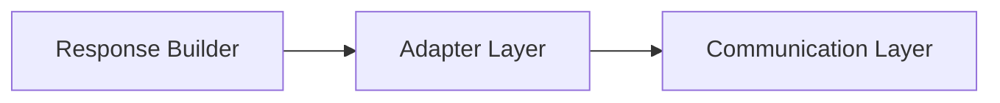
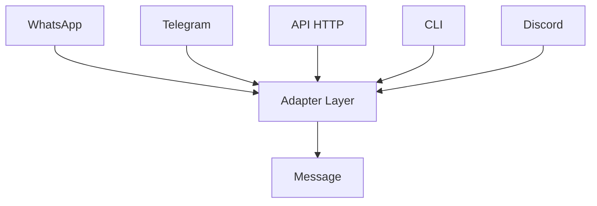
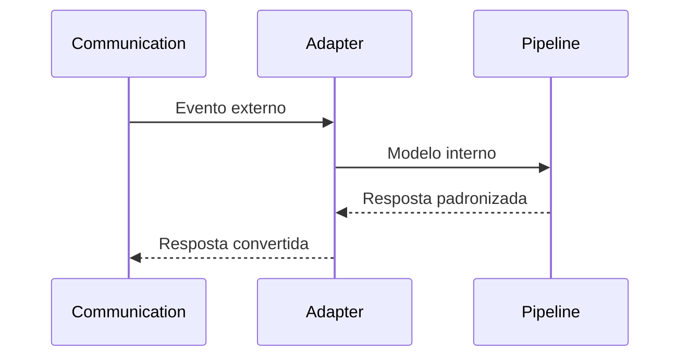

# Adapter Layer

**Versão:** 1.0

**Status:** Estável

---

# Resumo

| Item          | Valor               |
| ------------- | ------------------- |
| Categoria     | Infraestrutura      |
| Tipo          | Componente          |
| Estado        | Estável             |
| Introduzido   | Architecture v1.0   |
| Depende de    | Communication Layer |
| Utilizado por | Pipeline            |

---

# 1. Objetivo

O Adapter Layer é responsável por converter mensagens entre os formatos específicos dos canais de comunicação e o modelo interno utilizado pelo Assist Engine.

Ele representa a fronteira onde informações externas deixam de possuir características específicas de suas plataformas de origem e passam a ser tratadas como objetos pertencentes ao domínio arquitetural do Assist Engine.

A partir desse ponto, nenhum componente do Core precisa conhecer detalhes de protocolos, SDKs, APIs ou formatos específicos de qualquer canal de comunicação.

---

# 2. Papel na Arquitetura

O Adapter Layer estabelece a separação entre a infraestrutura de comunicação e o núcleo do Assist Engine.

Toda requisição obrigatoriamente atravessa essa camada antes de entrar no Core.

No retorno da resposta, o processo ocorre no sentido inverso.

O Adapter Layer é o único componente autorizado a conhecer simultaneamente o formato externo e o formato interno das mensagens.

---

# 3. Responsabilidades

Compete exclusivamente ao Adapter Layer:

* converter mensagens recebidas para o modelo interno do Assist Engine;
* converter respostas internas para o formato esperado pelo canal de comunicação;
* abstrair diferenças entre plataformas externas;
* preservar informações relevantes da requisição original;
* garantir que o restante da arquitetura trabalhe sempre com modelos padronizados.

O Adapter Layer atua exclusivamente como tradutor entre dois mundos.

---

# 4. Fora do Escopo

O Adapter Layer nunca deve:

* interpretar intenções;
* executar regras de negócio;
* tomar decisões arquiteturais;
* consultar Inteligência Artificial;
* executar ferramentas;
* construir respostas;
* modificar a lógica de uma mensagem;
* validar regras do domínio;
* acessar banco de dados.

Sua responsabilidade termina assim que a conversão entre modelos é concluída.

---

# 5. Entradas

O Adapter Layer recebe objetos produzidos pela Communication Layer.

Esses objetos podem representar qualquer tipo de evento suportado pelo canal de origem.

Exemplos:

* mensagens de texto;
* imagens;
* áudios;
* documentos;
* localização;
* interações em interfaces;
* eventos de sessão;
* webhooks.

Cada canal pode possuir sua própria estrutura de dados.

---

# 6. Saídas

Após a conversão, o Adapter Layer produz exclusivamente modelos internos pertencentes ao Assist Engine.

Esses modelos são independentes do canal de origem e podem ser utilizados por qualquer componente do Core.

Da mesma forma, durante o envio da resposta, o Adapter converte o modelo interno produzido pelo Response Builder para o formato esperado pela plataforma de destino.

---

# 7. Princípio da Normalização

A principal responsabilidade arquitetural do Adapter Layer é realizar a normalização das mensagens.

Independentemente de sua origem, toda requisição passa a possuir uma representação única dentro do Assist Engine.

Após essa etapa, o Core deixa de conhecer qualquer informação específica do canal de comunicação.

Para todos os componentes internos existe apenas uma mensagem padronizada.

Esse princípio garante independência tecnológica e reduz significativamente o acoplamento entre infraestrutura e domínio.

---

# 8. Dependências Permitidas

O Adapter Layer pode conhecer:

* Communication Layer;
* modelos internos do Assist Engine;
* estruturas de dados específicas dos canais;
* contratos de conversão;
* bibliotecas necessárias para transformação de formatos.

Essas dependências existem exclusivamente para permitir a tradução entre modelos.

---

# 9. Dependências Proibidas

O Adapter Layer nunca deve conhecer diretamente:

* Pipeline;
* Orchestrator;
* Decision Engine;
* Rule Engine;
* Tool Engine;
* AI Engine;
* Business Modules;
* Response Builder;
* regras de negócio;
* políticas de decisão.

Após produzir o modelo interno, toda responsabilidade passa ao Pipeline.

---

# 10. Ciclo de Vida

O Adapter participa apenas do início e do fim de cada requisição.

Durante todo o processamento interno do Assist Engine o Adapter permanece inativo.

---

# 11. Regras Arquiteturais

O Adapter Layer deve obedecer às seguintes regras:

* toda mensagem deve ser convertida antes de entrar no Core;
* nenhuma informação relevante do canal deve ser perdida durante a conversão;
* o modelo interno deve permanecer consistente independentemente da origem da requisição;
* nenhuma lógica de negócio deve ser implementada nesta camada;
* toda conversão deve ser determinística e reproduzível.

Essas regras garantem que o restante da arquitetura permaneça completamente desacoplado da infraestrutura de comunicação.

---

# 12. Relação com os Demais Componentes

O Adapter Layer ocupa uma posição singular na arquitetura.

Ele é o único componente autorizado a conhecer simultaneamente:

* o modelo de comunicação utilizado pelos canais externos;
* o modelo arquitetural utilizado pelo Assist Engine.

Nenhum outro componente possui essa responsabilidade.

Essa característica transforma o Adapter Layer em uma barreira de isolamento entre infraestrutura e Core.

---

# 13. Possíveis Evoluções

A arquitetura permite diversas evoluções sem alterar as responsabilidades do Adapter Layer.

Entre elas:

* novos adaptadores para diferentes canais;
* adaptação para múltiplas versões de APIs;
* suporte a novos formatos de mídia;
* serialização personalizada;
* compressão e descompressão de mensagens;
* adaptação para protocolos assíncronos;
* transformação automática entre versões de modelos.

Todas essas evoluções permanecem restritas ao processo de conversão entre formatos.

---

# 14. Considerações Finais

O Adapter Layer é o componente responsável por preservar a independência arquitetural do Assist Engine em relação aos canais de comunicação.

Ao transformar todas as mensagens em um modelo interno único, essa camada elimina a necessidade de que o Core conheça detalhes específicos de plataformas externas.

Esse isolamento permite que novos canais sejam incorporados ao sistema sem alterar sua lógica interna, mantendo a arquitetura modular, previsível e alinhada aos princípios estabelecidos na Architecture v1.0.
