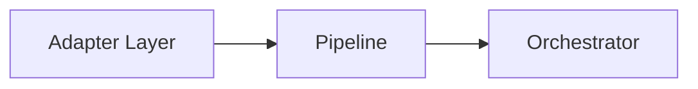
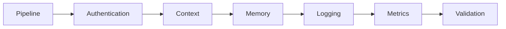
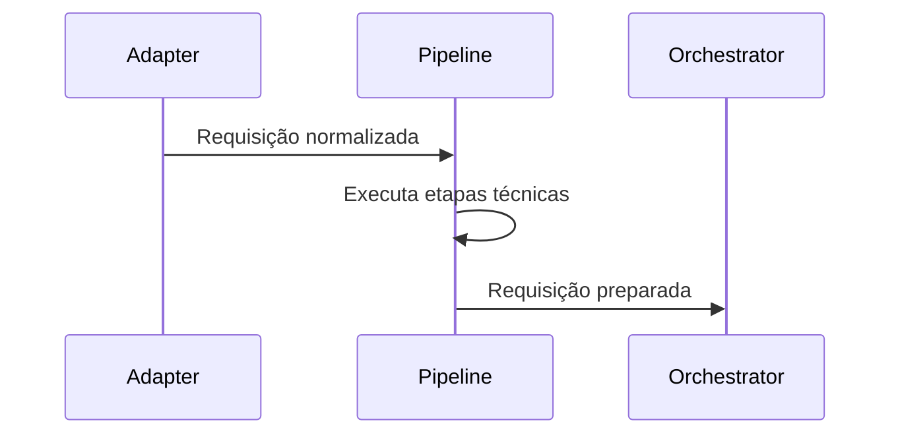

# Pipeline

**Versão:** 1.0

**Status:** Estável

---

# Resumo

| Item          | Valor             |
| ------------- | ----------------- |
| Categoria     | Infraestrutura    |
| Tipo          | Componente        |
| Estado        | Estável           |
| Introduzido   | Architecture v1.0 |
| Depende de    | Adapter Layer     |
| Utilizado por | Orchestrator      |

---

# 1. Objetivo

O Pipeline é responsável por preparar uma requisição para processamento pelo Core do Assist Engine.

Seu papel consiste em executar uma sequência ordenada de etapas técnicas que enriquecem, validam ou complementam a requisição antes que ela seja entregue ao Orchestrator.

O Pipeline não interpreta mensagens, não toma decisões e não executa regras de negócio.

Sua responsabilidade limita-se exclusivamente à preparação da requisição.

---

# 2. Papel na Arquitetura

O Pipeline representa a última etapa da infraestrutura antes da entrada da requisição no Core.

A partir do momento em que a requisição deixa o Pipeline, ela está completamente preparada para ser processada pelo Assist Engine.

---

# 3. Responsabilidades

Compete exclusivamente ao Pipeline:

* executar etapas técnicas de preparação;
* enriquecer o contexto da requisição;
* validar informações necessárias ao processamento;
* inicializar recursos utilizados pelo Core;
* garantir que toda requisição chegue ao Orchestrator em um estado consistente.

O Pipeline não altera o fluxo arquitetural nem interfere na estratégia de execução.

---

# 4. Fora do Escopo

O Pipeline nunca deve:

* interpretar linguagem natural;
* identificar intenções;
* decidir qual estratégia será utilizada;
* executar regras de negócio;
* consultar modelos de Inteligência Artificial;
* executar ferramentas;
* acessar módulos de domínio;
* construir respostas.

Sempre que alguma dessas necessidades surgir, a responsabilidade pertence ao Core.

---

# 5. Entradas

O Pipeline recebe exclusivamente o modelo interno produzido pelo Adapter Layer.

Nesse momento a mensagem já foi normalizada e não possui mais qualquer dependência do canal de origem.

---

# 6. Saídas

Ao finalizar sua execução, o Pipeline entrega ao Orchestrator uma requisição completamente preparada para processamento.

O formato da mensagem permanece o mesmo.

O que muda é o contexto associado à requisição.

---

# 7. Funcionamento

O Pipeline é composto por uma sequência ordenada de etapas independentes.

Cada etapa executa apenas uma responsabilidade técnica.

As etapas não conhecem umas às outras.

Cada uma recebe a requisição, executa sua responsabilidade e a encaminha para a próxima.

Essa organização favorece modularidade, reutilização e facilidade de manutenção.

---

# 8. Possíveis Etapas

A arquitetura não define quais etapas devem existir.

Cada aplicação pode compor seu próprio Pipeline.

Entre as etapas previstas estão:

* autenticação;
* autorização;
* identificação da conversa;
* recuperação de memória;
* construção do contexto;
* correlação da requisição;
* logging;
* métricas;
* observabilidade;
* validações técnicas;
* inicialização de serviços;
* carregamento de configurações.

Novas etapas podem ser adicionadas sem alterar o restante da arquitetura.

---

# 9. Princípio da Composição

O Pipeline é um componente composto.

Sua responsabilidade consiste em coordenar uma sequência de pequenas etapas independentes.

Cada etapa deve possuir responsabilidade única e ser reutilizável sempre que possível.

Essa organização evita a criação de componentes monolíticos e facilita a evolução incremental do sistema.

---

# 10. Dependências Permitidas

O Pipeline pode conhecer:

* modelos internos do Assist Engine;
* contratos das etapas do Pipeline;
* serviços de infraestrutura;
* componentes necessários para preparação técnica da requisição.

Todas essas dependências existem exclusivamente para preparar o processamento.

---

# 11. Dependências Proibidas

O Pipeline nunca deve conhecer diretamente:

* Decision Engine;
* Rule Engine;
* Tool Engine;
* AI Engine;
* Business Modules;
* políticas de decisão;
* regras de domínio;
* lógica de atendimento.

Essas responsabilidades pertencem exclusivamente ao Core.

---

# 12. Ciclo de Vida

O Pipeline participa apenas da preparação da requisição.

Após encaminhar a requisição ao Orchestrator, o Pipeline encerra sua participação no processamento.

---

# 13. Regras Arquiteturais

O Pipeline deve obedecer às seguintes regras:

* executar etapas sempre na ordem definida;
* cada etapa deve possuir responsabilidade única;
* etapas devem ser independentes entre si;
* nenhuma etapa deve alterar o fluxo arquitetural;
* nenhuma etapa pode tomar decisões de negócio;
* nenhuma etapa pode escolher estratégias de execução;
* todas as etapas devem ser determinísticas e reproduzíveis.

Essas regras preservam a simplicidade e previsibilidade do Pipeline.

---

# 14. Relação com os Demais Componentes

O Pipeline atua como a ponte entre a infraestrutura e o Core.

Ele recebe uma requisição já normalizada pelo Adapter Layer, executa todas as preparações necessárias e entrega ao Orchestrator uma requisição pronta para processamento.

Seu papel termina exatamente nesse ponto.

A partir daí, todas as decisões passam a ser responsabilidade do Core.

---

# 15. Possíveis Evoluções

A arquitetura permite diversas evoluções para o Pipeline sem alterar seus princípios.

Entre elas:

* composição dinâmica de etapas;
* habilitação ou desabilitação de etapas por configuração;
* execução condicional de etapas técnicas;
* monitoramento individual das etapas;
* métricas de desempenho;
* cache de contexto;
* mecanismos de recuperação em caso de falha.

Essas evoluções permanecem restritas ao processo de preparação da requisição.

---

# 16. Considerações Finais

O Pipeline garante que toda requisição chegue ao Core em condições adequadas para processamento.

Ao concentrar exclusivamente responsabilidades técnicas de preparação, preserva a separação entre infraestrutura e lógica arquitetural, mantendo o Assist Engine modular, previsível e de fácil evolução.

Sua existência permite que novas funcionalidades de infraestrutura sejam incorporadas ao sistema sem impactar o fluxo principal nem as decisões tomadas pelo Core.
