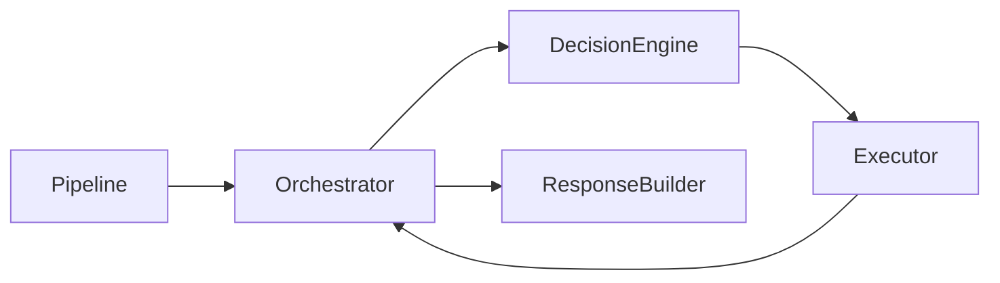
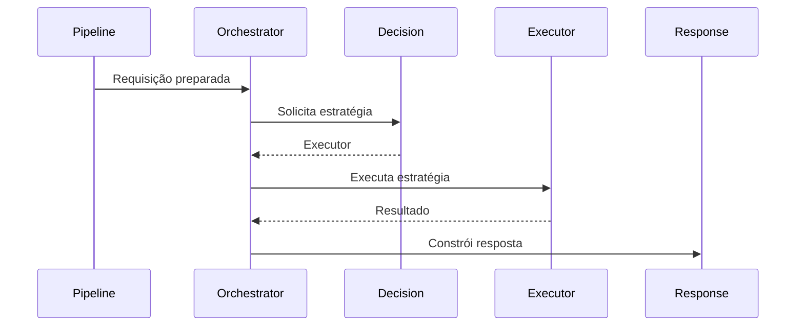
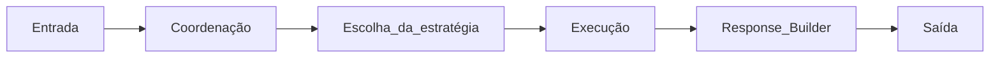

# Orchestrator

**Versão:** 1.0

**Status:** Estável

---

# Resumo

| Item          | Valor                                       |
| ------------- | ------------------------------------------- |
| Categoria     | Core                                        |
| Tipo          | Componente                                  |
| Estado        | Estável                                     |
| Introduzido   | Architecture v1.0                           |
| Depende de    | Pipeline, Decision Engine, Response Builder |
| Utilizado por | Pipeline                                    |

---

# 1. Objetivo

O Orchestrator é o componente responsável por coordenar o fluxo de processamento de uma requisição dentro do Assist Engine.

Sua responsabilidade consiste em controlar a sequência de execução dos componentes do Core, garantindo que cada etapa seja executada na ordem correta e que o resultado final seja encaminhado ao Response Builder.

O Orchestrator não interpreta mensagens, não aplica regras de negócio e não escolhe estratégias de execução.

Sua única responsabilidade é coordenar o fluxo arquitetural.

---

# 2. Papel na Arquitetura

O Orchestrator representa o ponto central de coordenação do Core.

Toda requisição que entra no Core passa obrigatoriamente pelo Orchestrator.

---

# 3. Responsabilidades

Compete exclusivamente ao Orchestrator:

* iniciar o processamento interno da requisição;
* coordenar a sequência de execução do Core;
* solicitar ao Decision Engine a estratégia de execução;
* encaminhar a requisição ao executor escolhido;
* receber o resultado produzido;
* encaminhar o resultado ao Response Builder;
* finalizar o fluxo da requisição.

O Orchestrator atua como coordenador do processo, nunca como executor da lógica de negócio.

---

# 4. Fora do Escopo

O Orchestrator nunca deve:

* interpretar linguagem natural;
* identificar intenções;
* selecionar estratégias de execução;
* executar regras determinísticas;
* chamar modelos de IA diretamente;
* executar ferramentas;
* implementar regras de negócio;
* construir respostas;
* conhecer detalhes dos canais de comunicação.

Sempre que uma dessas responsabilidades surgir, ela deve ser delegada ao componente especializado.

---

# 5. Entradas

O Orchestrator recebe exclusivamente uma requisição preparada pelo Pipeline.

Nesse momento:

* a mensagem já está normalizada;
* o contexto já foi construído;
* todas as etapas técnicas já foram executadas.

O Orchestrator assume que a requisição está pronta para processamento.

---

# 6. Saídas

O resultado produzido pelo executor selecionado é encaminhado ao Response Builder.

O Orchestrator não modifica o conteúdo da resposta.

Ele apenas coordena sua passagem entre os componentes.

---

# 7. Fluxo de Coordenação

O fluxo coordenado pelo Orchestrator segue sempre a mesma sequência.

Esse fluxo permanece constante independentemente do executor escolhido.

---

# 8. Relação com o Decision Engine

O Orchestrator e o Decision Engine possuem responsabilidades complementares.

O Orchestrator coordena.

O Decision Engine decide.

O Orchestrator nunca substitui decisões do Decision Engine, assim como o Decision Engine nunca coordena o fluxo arquitetural.

Essa separação preserva a responsabilidade única de ambos os componentes.

---

# 9. Estratégia Única de Execução

O Assist Engine adota como princípio arquitetural que cada requisição seja atendida por uma única estratégia de execução.

Após consultar o Decision Engine, o Orchestrator executa exatamente um dos seguintes componentes:

* Rule Engine;
* Tool Engine;
* AI Engine;
* Business Modules;
* Human Handoff (quando aplicável).

Após a conclusão da estratégia escolhida, o fluxo segue diretamente para o Response Builder.

O Orchestrator não executa múltiplas estratégias em sequência na versão 1.0 da arquitetura.

---

# 10. Dependências Permitidas

O Orchestrator pode conhecer:

* contratos do Pipeline;
* contratos do Decision Engine;
* contratos dos executores;
* contratos do Response Builder;
* modelos internos da requisição e da resposta.

Ele depende apenas de contratos, nunca de implementações específicas.

---

# 11. Dependências Proibidas

O Orchestrator nunca deve conhecer:

* SDKs de canais de comunicação;
* APIs externas;
* provedores de IA;
* regras específicas de domínio;
* implementações internas dos executores;
* lógica de infraestrutura.

Toda comunicação ocorre exclusivamente por meio de contratos.

---

# 12. Ciclo de Vida

O Orchestrator participa de praticamente todo o processamento interno da requisição.

Sua participação termina quando a resposta é entregue ao Response Builder.

---

# 13. Regras Arquiteturais

O Orchestrator deve obedecer às seguintes regras:

* coordenar todo o fluxo do Core;
* nunca executar lógica de negócio;
* nunca selecionar estratégias;
* nunca construir respostas;
* nunca conhecer implementações concretas;
* comunicar-se exclusivamente por contratos;
* manter o fluxo arquitetural previsível.

Essas regras garantem que o componente permaneça pequeno, estável e focado em coordenação.

---

# 14. Possíveis Evoluções

A arquitetura permite diversas evoluções para o Orchestrator sem alterar sua responsabilidade.

Entre elas:

* execução assíncrona de estratégias;
* orquestração distribuída;
* monitoramento de fluxo;
* telemetria;
* tracing distribuído;
* cancelamento de requisições;
* timeout configurável;
* políticas de retry.

Essas evoluções dizem respeito exclusivamente ao controle do fluxo e não alteram o papel do componente.

---

# 15. Relação com os Demais Componentes

O Orchestrator ocupa a posição central do Core.

Ele conecta:

* o Pipeline ao Core;
* o Decision Engine aos executores;
* os executores ao Response Builder.

Apesar dessa posição central, ele permanece desacoplado das implementações concretas, conhecendo apenas contratos arquiteturais.

Essa característica garante que a evolução de qualquer executor não impacte o fluxo coordenado pelo Orchestrator.

---

# 16. Considerações Finais

O Orchestrator é o componente responsável por manter o fluxo arquitetural do Assist Engine consistente, previsível e independente das estratégias utilizadas para atender uma requisição.

Ao concentrar exclusivamente a coordenação do processamento, preserva a separação entre controle de fluxo, tomada de decisão e execução, evitando acoplamentos indevidos entre os componentes do Core.

Essa organização reforça os princípios da Architecture v1.0 e estabelece uma base sólida para a evolução futura do Assist Engine sem comprometer sua simplicidade ou modularidade.
