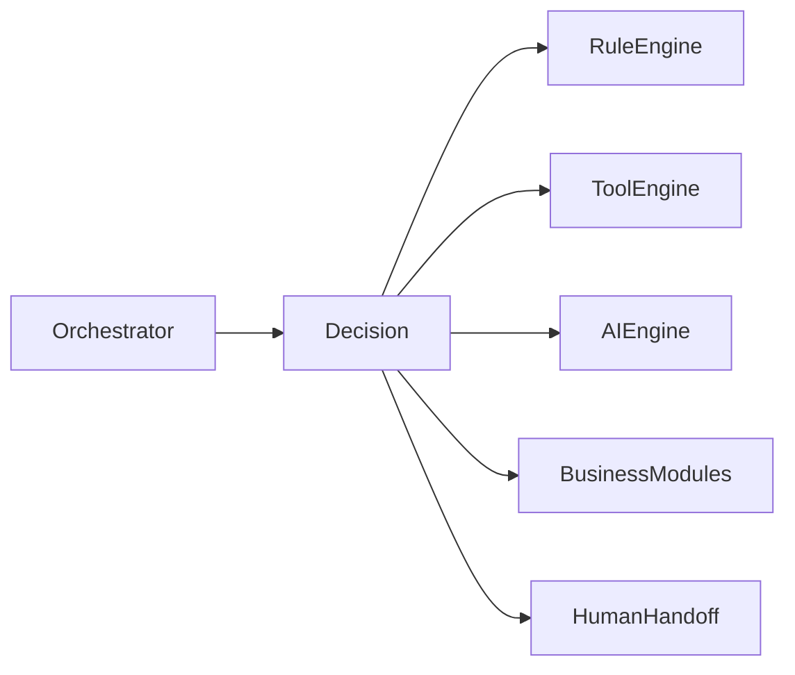
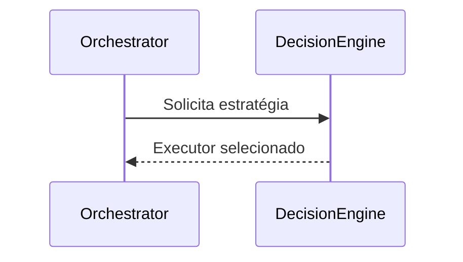

# Decision Engine

**Versão:** 1.0

**Status:** Estável

---

# Resumo

| Item          | Valor                    |
| ------------- | ------------------------ |
| Categoria     | Core                     |
| Tipo          | Componente               |
| Estado        | Estável                  |
| Introduzido   | Architecture v1.0        |
| Depende de    | Contratos dos Executores |
| Utilizado por | Orchestrator             |

---

# 1. Objetivo

O Decision Engine é o componente responsável por determinar qual estratégia de execução será utilizada para atender uma requisição.

Sua responsabilidade consiste em analisar o contexto disponível e selecionar exatamente um executor capaz de processar a solicitação.

O Decision Engine não executa a estratégia escolhida. Sua responsabilidade termina no momento em que a decisão é tomada.

---

# 2. Papel na Arquitetura

O Decision Engine representa o mecanismo de tomada de decisão do Assist Engine.

Após selecionar a estratégia adequada, o controle retorna ao Orchestrator, responsável por coordenar sua execução.

---

# 3. Responsabilidades

Compete exclusivamente ao Decision Engine:

* analisar o contexto da requisição;
* identificar a estratégia mais adequada;
* selecionar um único executor;
* devolver essa decisão ao Orchestrator;
* preservar os princípios arquiteturais de seleção.

O Decision Engine nunca participa da execução da estratégia escolhida.

---

# 4. Fora do Escopo

O Decision Engine nunca deve:

* executar regras determinísticas;
* consultar modelos de Inteligência Artificial;
* executar ferramentas;
* aplicar regras de negócio;
* construir respostas;
* coordenar o fluxo arquitetural;
* comunicar-se com canais externos;
* modificar a requisição.

Seu papel limita-se exclusivamente à tomada de decisão.

---

# 5. Entradas

O Decision Engine recebe uma requisição já preparada pelo Pipeline e encaminhada pelo Orchestrator.

Nesse momento, a requisição pode conter:

* mensagem normalizada;
* contexto da conversa;
* informações do usuário;
* memória recuperada;
* metadados técnicos;
* demais informações produzidas durante a preparação da requisição.

Esses dados constituem a base para a tomada de decisão.

---

# 6. Saídas

O resultado produzido pelo Decision Engine consiste exclusivamente na estratégia de execução selecionada.

Essa estratégia representa o executor que deverá ser utilizado pelo Orchestrator.

Nenhuma lógica de processamento é executada nesta etapa.

---

# 7. Estratégia Única de Execução

O Assist Engine estabelece como princípio arquitetural que cada requisição seja atendida por uma única estratégia de execução.

Assim, para cada requisição, o Decision Engine seleciona exatamente um dos seguintes executores:

* Rule Engine;
* Tool Engine;
* AI Engine;
* Business Modules;
* Human Handoff.

Após essa seleção, nenhuma outra estratégia é avaliada durante o processamento da mesma requisição.

Essa decisão garante previsibilidade, simplicidade e baixo acoplamento entre os componentes do Core.

---

# 8. Critérios de Decisão

A arquitetura não define como a decisão deve ser implementada.

O mecanismo utilizado pode evoluir ao longo do tempo, desde que preserve o contrato do componente.

Exemplos de critérios possíveis:

* tipo da mensagem;
* estado da conversa;
* contexto disponível;
* políticas configuradas;
* regras arquiteturais;
* capacidades dos executores.

O restante da arquitetura permanece independente da estratégia utilizada para decidir.

---

# 9. Dependências Permitidas

O Decision Engine pode conhecer:

* contratos dos executores;
* contratos da requisição;
* políticas de decisão;
* estratégias de seleção;
* modelos internos necessários para a análise.

Essas dependências existem exclusivamente para permitir a tomada de decisão.

---

# 10. Dependências Proibidas

O Decision Engine nunca deve conhecer diretamente:

* implementações concretas dos executores;
* SDKs de ferramentas;
* provedores de IA;
* APIs externas;
* canais de comunicação;
* regras específicas de domínio;
* infraestrutura do sistema.

Sua comunicação deve ocorrer exclusivamente por contratos arquiteturais.

---

# 11. Ciclo de Vida

O Decision Engine participa de apenas um momento do processamento da requisição.

Após retornar sua decisão, o componente encerra sua participação.

---

# 12. Regras Arquiteturais

O Decision Engine deve obedecer às seguintes regras:

* selecionar exatamente uma estratégia;
* nunca executar a estratégia escolhida;
* nunca coordenar o fluxo arquitetural;
* comunicar-se apenas por contratos;
* manter independência das implementações concretas;
* produzir decisões determinísticas quando aplicável.

Essas regras preservam a responsabilidade única do componente.

---

# 13. Relação com os Executores

O Decision Engine não possui conhecimento sobre o funcionamento interno dos executores.

Seu papel limita-se a identificar qual executor é capaz de atender a requisição.

Essa separação garante que novos executores possam ser adicionados sem alterar a arquitetura do Core.

---

# 14. Possíveis Evoluções

A arquitetura permite diversas evoluções para o Decision Engine.

Entre elas:

* mecanismos baseados em regras;
* políticas configuráveis; (Johnison achou interessante)
* estratégias hierárquicas;
* seleção baseada em capacidades;
* aprendizado sobre decisões anteriores;  (Johnison achou interessante)
* mecanismos de pontuação; (Johnison achou interessante)
* múltiplos perfis de decisão.

Independentemente da evolução adotada, o contrato arquitetural permanece o mesmo: selecionar exatamente uma estratégia de execução.

---

# 15. Relação com os Demais Componentes

O Decision Engine atua entre o Orchestrator e os executores.

Ele não recebe mensagens diretamente do Pipeline nem envia respostas ao Response Builder.

Sua única responsabilidade é fornecer ao Orchestrator a decisão necessária para continuidade do fluxo.

Essa posição garante que o mecanismo de decisão permaneça isolado da coordenação e da execução.

---

# 16. Considerações Finais

O Decision Engine representa o mecanismo de tomada de decisão do Assist Engine.

Ao separar completamente a escolha da estratégia de sua execução, a arquitetura preserva responsabilidades bem definidas, reduz o acoplamento entre os componentes do Core e permite que novas estratégias de decisão sejam incorporadas sem alterar o fluxo arquitetural.

Essa separação torna o Assist Engine flexível para evoluções futuras, mantendo a simplicidade e a previsibilidade estabelecidas pela Architecture v1.0.
