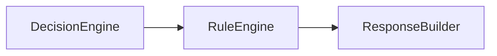
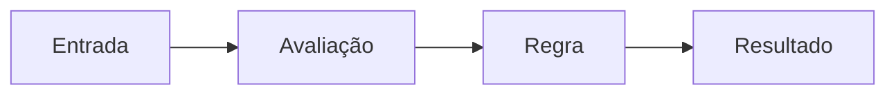
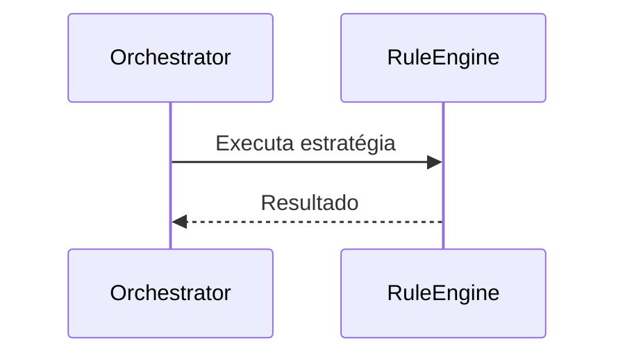

# Rule Engine

**Versão:** 1.0

**Status:** Estável

---

# Resumo

| Item          | Valor               |
| ------------- | ------------------- |
| Categoria     | Core                |
| Tipo          | Executor            |
| Estado        | Estável             |
| Introduzido   | Architecture v1.0   |
| Depende de    | Contratos de Regras |
| Utilizado por | Orchestrator        |

---

# 1. Objetivo

O Rule Engine é o executor responsável por processar requisições utilizando regras determinísticas previamente definidas.

Seu objetivo é fornecer respostas previsíveis, reproduzíveis e de baixo custo computacional para situações em que não há necessidade de utilizar Inteligência Artificial ou ferramentas externas.

O Rule Engine representa a estratégia de execução mais simples e eficiente disponível no Assist Engine.

---

# 2. Papel na Arquitetura

O Rule Engine é um dos executores que podem ser selecionados pelo Decision Engine.

Quando selecionado, o Rule Engine executa integralmente a requisição e devolve um resultado padronizado ao Orchestrator.

---

# 3. Responsabilidades

Compete exclusivamente ao Rule Engine:

* executar regras determinísticas;
* avaliar condições previamente definidas;
* produzir respostas baseadas em lógica conhecida;
* garantir comportamento previsível;
* retornar o resultado da execução ao Orchestrator.

O Rule Engine nunca consulta modelos de Inteligência Artificial nem executa ferramentas externas.

---

# 4. Fora do Escopo

O Rule Engine nunca deve:

* interpretar linguagem natural por meio de IA;
* acessar provedores de modelos de linguagem;
* executar ferramentas;
* coordenar o fluxo arquitetural;
* selecionar estratégias de execução;
* construir respostas finais;
* comunicar-se com canais externos.

Sua responsabilidade termina após produzir o resultado da regra executada.

---

# 5. Entradas

O Rule Engine recebe uma requisição já preparada pelo Pipeline e encaminhada pelo Orchestrator após a seleção realizada pelo Decision Engine.

Essa requisição contém todas as informações necessárias para avaliação das regras.

---

# 6. Saídas

O Rule Engine produz um resultado padronizado contendo o desfecho da execução da regra.

Esse resultado será posteriormente transformado em uma resposta pelo Response Builder.

---

# 7. Funcionamento

O processamento realizado pelo Rule Engine é inteiramente determinístico.

Dada a mesma entrada, a saída produzida será sempre a mesma.

Essa característica garante previsibilidade e facilita testes automatizados.

---

# 8. Tipos de Regras

A arquitetura não limita quais regras podem ser implementadas.

Entre os exemplos mais comuns estão:

* validações técnicas;
* comandos conhecidos;
* respostas estáticas;
* verificações de permissões;
* políticas de acesso;
* redirecionamentos;
* decisões configuráveis;
* regras de negócio determinísticas.

Cada regra deve possuir responsabilidade única e ser independente das demais.

---

# 9. Princípios do Rule Engine

O Rule Engine deve seguir os seguintes princípios:

* determinismo;
* previsibilidade;
* simplicidade;
* baixo custo computacional;
* alta performance;
* independência de IA;
* independência de ferramentas externas.

Esses princípios tornam o Rule Engine a estratégia preferencial sempre que uma requisição puder ser resolvida sem recorrer a mecanismos mais complexos.

---

# 10. Dependências Permitidas

O Rule Engine pode conhecer:

* contratos das regras;
* modelos internos da requisição;
* modelos internos do resultado;
* políticas determinísticas;
* componentes auxiliares necessários para avaliação das regras.

Todas essas dependências devem permanecer independentes da infraestrutura.

---

# 11. Dependências Proibidas

O Rule Engine nunca deve conhecer diretamente:

* provedores de IA;
* APIs externas;
* SDKs de ferramentas;
* canais de comunicação;
* Pipeline;
* Decision Engine;
* Response Builder;
* lógica de coordenação do Core.

Seu foco exclusivo é a execução das regras.

---

# 12. Ciclo de Vida

O Rule Engine participa apenas durante a execução da estratégia selecionada.

Após devolver o resultado, sua participação é encerrada.

---

# 13. Regras Arquiteturais

O Rule Engine deve obedecer às seguintes regras:

* executar exclusivamente regras determinísticas;
* produzir resultados reproduzíveis;
* nunca alterar o fluxo arquitetural;
* nunca selecionar estratégias;
* nunca construir respostas finais;
* nunca utilizar Inteligência Artificial;
* nunca executar ferramentas externas.

Essas regras garantem que o componente permaneça simples, previsível e altamente eficiente.

---

# 14. Possíveis Evoluções

A arquitetura permite diversas evoluções para o Rule Engine.

Entre elas:

* mecanismos de priorização de regras;
* agrupamento de regras por domínio;
* carregamento dinâmico de regras;
* versionamento de conjuntos de regras;
* cache de avaliações;
* métricas de execução;
* monitoramento de desempenho.

Essas evoluções não alteram a responsabilidade principal do componente.

---

# 15. Relação com os Demais Executores

O Rule Engine é um dos executores disponíveis ao Decision Engine.

Sua principal característica é resolver requisições sem recorrer a Inteligência Artificial ou ferramentas externas.

Quando uma regra determinística é suficiente para atender a solicitação, o Rule Engine representa a estratégia de execução mais eficiente da arquitetura.

Essa abordagem reduz custos, diminui a latência e aumenta a previsibilidade do sistema.

---

# 16. Considerações Finais

O Rule Engine representa a estratégia de execução determinística do Assist Engine.

Ao concentrar toda a lógica baseada em regras em um componente especializado, a arquitetura preserva a separação entre decisões, coordenação e execução, além de evitar o uso desnecessário de Inteligência Artificial em cenários que podem ser resolvidos de forma simples e previsível.

Essa abordagem reforça um dos princípios fundamentais do Assist Engine: utilizar sempre a estratégia mais adequada para cada requisição, priorizando eficiência, simplicidade e baixo acoplamento.
