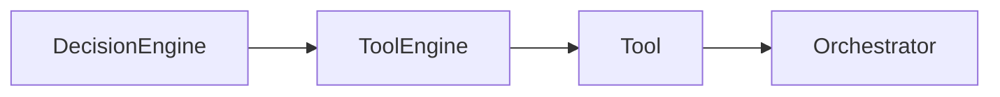
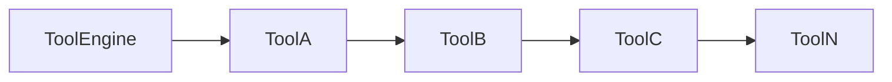
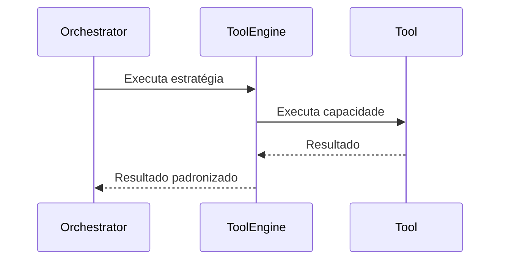

# Tool Engine

**Versão:** 1.0

**Status:** Estável

---

# Resumo

| Item          | Valor              |
| ------------- | ------------------ |
| Categoria     | Serviço            |
| Tipo          | Executor           |
| Estado        | Estável            |
| Introduzido   | Architecture v1.0  |
| Depende de    | Contratos de Tools |
| Utilizado por | Orchestrator       |

---

# 1. Objetivo

O Tool Engine é o executor responsável por utilizar capacidades externas ao Core do Assist Engine.

Seu objetivo é permitir que a arquitetura execute ações no ambiente externo sem acoplar o núcleo da aplicação a APIs, bancos de dados, serviços ou bibliotecas específicas.

Cada Tool representa uma capacidade disponível ao sistema.

O Tool Engine é responsável por localizar, executar e devolver o resultado da Tool selecionada.

---

# 2. Papel na Arquitetura

O Tool Engine é um dos executores disponíveis ao Decision Engine.

Após a execução da Tool, o resultado retorna ao Orchestrator para continuidade do fluxo arquitetural.

---

# 3. Responsabilidades

Compete exclusivamente ao Tool Engine:

* localizar a Tool apropriada;
* executar a Tool selecionada;
* padronizar o resultado da execução;
* tratar falhas relacionadas à execução da Tool;
* devolver o resultado ao Orchestrator.

O Tool Engine nunca decide quando uma Tool deve ser utilizada.

Essa decisão pertence exclusivamente ao Decision Engine.

---

# 4. Fora do Escopo

O Tool Engine nunca deve:

* selecionar estratégias de execução;
* interpretar linguagem natural;
* coordenar o fluxo arquitetural;
* construir respostas finais;
* implementar regras de negócio do domínio;
* comunicar-se diretamente com canais de comunicação.

Sua responsabilidade limita-se à execução das capacidades disponibilizadas pelas Tools.

---

# 5. Entradas

O Tool Engine recebe do Orchestrator:

* a requisição;
* a Tool selecionada;
* os parâmetros necessários para sua execução.

O formato desses parâmetros pertence exclusivamente ao contrato definido pela própria Tool.

---

# 6. Saídas

Após executar a Tool, o Tool Engine devolve ao Orchestrator um resultado padronizado.

Esse resultado poderá ser utilizado diretamente pelo Response Builder ou processado pelo executor correspondente, conforme definido pela estratégia de execução.

---

# 7. O Conceito de Tool

Uma Tool representa uma capacidade do sistema.

Ela encapsula uma ação específica e reutilizável.

Exemplos:

* consultar banco de dados;
* enviar e-mail;
* consumir API REST;
* consultar agenda;
* emitir documentos;
* calcular valores;
* enviar notificações;
* acessar sistemas externos.

Cada Tool deve possuir responsabilidade única.

Ela existe para executar uma ação específica, não para coordenar processos completos.

---

# 8. Registro de Tools

O Tool Engine trabalha exclusivamente com Tools registradas na aplicação.

Novas capacidades podem ser adicionadas registrando novas Tools, sem necessidade de alterar o funcionamento do Tool Engine.

Esse princípio favorece extensibilidade e reutilização.

---

# 9. Dependências Permitidas

O Tool Engine pode conhecer:

* contratos das Tools;
* modelos internos da requisição;
* modelos internos do resultado;
* mecanismos de registro de Tools;
* componentes auxiliares necessários para execução.

Ele nunca depende de implementações concretas do Core.

---

# 10. Dependências Proibidas

O Tool Engine nunca deve conhecer diretamente:

* Decision Engine;
* Pipeline;
* Response Builder;
* canais de comunicação;
* provedores de IA;
* regras específicas de domínio;
* infraestrutura de comunicação.

Toda interação ocorre por contratos arquiteturais.

---

# 11. Ciclo de Vida

O Tool Engine participa apenas durante a execução da estratégia selecionada.

Após devolver o resultado, sua participação é encerrada.

---

# 12. Regras Arquiteturais

O Tool Engine deve obedecer às seguintes regras:

* executar exclusivamente Tools registradas;
* nunca decidir qual Tool utilizar;
* nunca implementar regras de negócio;
* nunca conhecer canais de comunicação;
* nunca comunicar-se diretamente com modelos de IA;
* devolver resultados padronizados ao Orchestrator.

Essas regras preservam a responsabilidade única do componente.

---

# 13. Relação com as Tools

O Tool Engine não implementa capacidades.

Ele apenas coordena sua execução.

Cada Tool é responsável exclusivamente pela ação que representa.

Essa separação permite que novas capacidades sejam incorporadas ao Assist Engine sem modificar o Tool Engine.

---

# 14. Possíveis Evoluções

A arquitetura permite diversas evoluções para o Tool Engine.

Entre elas:

* descoberta automática de Tools;
* carregamento por módulos;
* versionamento de Tools;
* políticas de autorização;
* métricas individuais;
* timeout por Tool;
* retry configurável;
* execução assíncrona;
* monitoramento de desempenho.

Essas evoluções não alteram a responsabilidade principal do componente.

---

# 15. Relação com os Demais Executores

O Tool Engine representa a estratégia utilizada quando a requisição exige a execução de uma capacidade do sistema.

Diferentemente do Rule Engine, que resolve problemas determinísticos, e do AI Engine, especializado em linguagem natural, o Tool Engine executa ações concretas sobre recursos internos ou externos.

Essa separação permite que o Assist Engine permaneça desacoplado das tecnologias utilizadas pelas integrações.

---

# 16. Considerações Finais

O Tool Engine estabelece um mecanismo padronizado para execução de capacidades dentro do Assist Engine.

Ao tratar cada Tool como uma unidade independente e reutilizável, a arquitetura preserva baixo acoplamento, alta coesão e facilidade de evolução.

Essa abordagem permite integrar novos serviços, APIs e recursos externos ao sistema sem alterar o Core, mantendo o Assist Engine modular e alinhado aos princípios definidos na Architecture v1.0.
