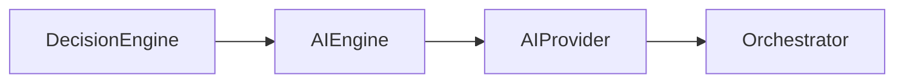
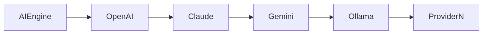
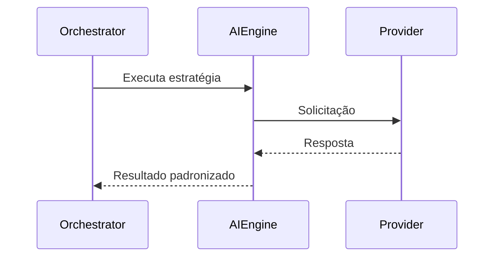

# AI Engine

**Versão:** 1.0

**Status:** Estável

---

# Resumo

| Item          | Valor                     |
| ------------- | ------------------------- |
| Categoria     | Serviço                   |
| Tipo          | Executor                  |
| Estado        | Estável                   |
| Introduzido   | Architecture v1.0         |
| Depende de    | Contratos de AI Providers |
| Utilizado por | Orchestrator              |

---

# 1. Objetivo

O AI Engine é o executor responsável por realizar tarefas que exigem capacidades de Inteligência Artificial, especialmente aquelas relacionadas à interpretação e geração de linguagem natural.

Seu objetivo é fornecer ao Assist Engine uma interface arquitetural única para utilização de modelos de IA, mantendo o Core completamente independente de provedores, modelos e tecnologias específicas.

O AI Engine representa a capacidade de processamento de linguagem natural da arquitetura, e não um provedor específico de Inteligência Artificial.

---

# 2. Papel na Arquitetura

O AI Engine é um dos executores disponíveis ao Decision Engine.

Quando selecionado, o AI Engine delega a execução ao provedor configurado e devolve o resultado ao Orchestrator.

---

# 3. Responsabilidades

Compete exclusivamente ao AI Engine:

* comunicar-se com provedores de Inteligência Artificial;
* abstrair diferenças entre modelos e fornecedores;
* encaminhar solicitações ao provedor configurado;
* receber e padronizar as respostas produzidas;
* devolver o resultado ao Orchestrator.

O AI Engine não toma decisões sobre quando utilizar Inteligência Artificial.

Essa responsabilidade pertence exclusivamente ao Decision Engine.

---

# 4. Fora do Escopo

O AI Engine nunca deve:

* selecionar estratégias de execução;
* coordenar o fluxo arquitetural;
* executar regras determinísticas;
* implementar regras de negócio;
* construir respostas finais;
* comunicar-se diretamente com canais externos.

Sua responsabilidade limita-se à utilização da capacidade de processamento de linguagem natural disponibilizada pelos provedores de IA.

---

# 5. Entradas

O AI Engine recebe do Orchestrator:

* a requisição;
* o contexto preparado pelo Pipeline;
* as informações necessárias para processamento pelo modelo de IA.

A forma como essas informações serão utilizadas depende exclusivamente do provedor configurado.

---

# 6. Saídas

Após o processamento pelo modelo de IA, o AI Engine devolve ao Orchestrator um resultado padronizado.

O restante da arquitetura permanece completamente independente do formato utilizado pelo provedor.

---

# 7. AI Providers

O AI Engine comunica-se exclusivamente com contratos definidos pelo Core.

Cada provedor implementa o mesmo contrato arquitetural.

Isso permite substituir modelos sem modificar qualquer outro componente do Assist Engine.

---

# 8. Independência dos Provedores

O Assist Engine não possui dependência arquitetural de qualquer fornecedor específico de Inteligência Artificial.

Toda integração ocorre por meio de contratos.

Essa abordagem permite:

* substituir provedores;
* utilizar múltiplos modelos;
* executar modelos locais;
* incorporar novos fornecedores futuramente.

O Core permanece completamente independente dessas decisões.

---

# 9. Dependências Permitidas

O AI Engine pode conhecer:

* contratos de AI Providers;
* modelos internos da requisição;
* modelos internos do resultado;
* componentes auxiliares necessários para comunicação com os provedores.

Nenhuma implementação concreta deve ser conhecida pelo restante do Core.

---

# 10. Dependências Proibidas

O AI Engine nunca deve conhecer diretamente:

* canais de comunicação;
* Pipeline;
* Decision Engine;
* Response Builder;
* Tool Engine;
* Rule Engine;
* módulos de negócio.

Sua responsabilidade limita-se ao processamento de linguagem natural.

---

# 11. Ciclo de Vida

O AI Engine participa apenas durante a execução da estratégia selecionada.

Após devolver o resultado ao Orchestrator, sua participação é encerrada.

---

# 12. Regras Arquiteturais

O AI Engine deve obedecer às seguintes regras:

* comunicar-se exclusivamente por contratos de AI Providers;
* nunca conhecer implementações concretas do Core;
* nunca decidir quando utilizar IA;
* nunca implementar regras de negócio;
* devolver resultados padronizados ao Orchestrator;
* permanecer independente de qualquer fornecedor específico.

Essas regras garantem a substituição transparente dos provedores de IA.

---

# 13. Relação com os AI Providers

O AI Engine representa a camada arquitetural responsável pelo processamento de linguagem natural.

Os AI Providers representam apenas implementações concretas dessa capacidade.

Essa separação permite que o Assist Engine evolua tecnologicamente sem comprometer sua arquitetura.

---

# 14. Relação com os Demais Executores

O AI Engine representa a estratégia utilizada quando uma requisição exige capacidades que não podem ser atendidas por regras determinísticas ou ferramentas.

Conforme estabelecido pelas decisões arquiteturais do projeto, a Inteligência Artificial deve ser utilizada apenas quando as demais estratégias não forem suficientes para atender a solicitação.

Essa filosofia reduz custos operacionais, aumenta previsibilidade e preserva o caráter determinístico da arquitetura sempre que possível.

---

# 15. Possíveis Evoluções

A arquitetura permite diversas evoluções para o AI Engine.

Entre elas:

* múltiplos provedores simultâneos;
* seleção dinâmica de modelos;
* fallback entre provedores;
* balanceamento de carga;
* cache de respostas;
* observabilidade específica;
* métricas de consumo;
* monitoramento de tokens;
* otimização automática de prompts.

Todas essas evoluções permanecem restritas ao AI Engine e aos contratos dos AI Providers.

---

# 16. Considerações Finais

O AI Engine representa a capacidade arquitetural de processamento de linguagem natural do Assist Engine.

Ao abstrair completamente os provedores de Inteligência Artificial, preserva a independência tecnológica do Core e garante que novos modelos possam ser incorporados sem alterações na arquitetura.

Essa abordagem reforça um dos princípios fundamentais do projeto: a Inteligência Artificial é uma capacidade especializada do sistema, e não o seu elemento central. O Assist Engine permanece responsável pela coordenação, pelas decisões arquiteturais e pela lógica da aplicação, utilizando IA apenas quando essa for a estratégia mais adequada para atender uma requisição.
