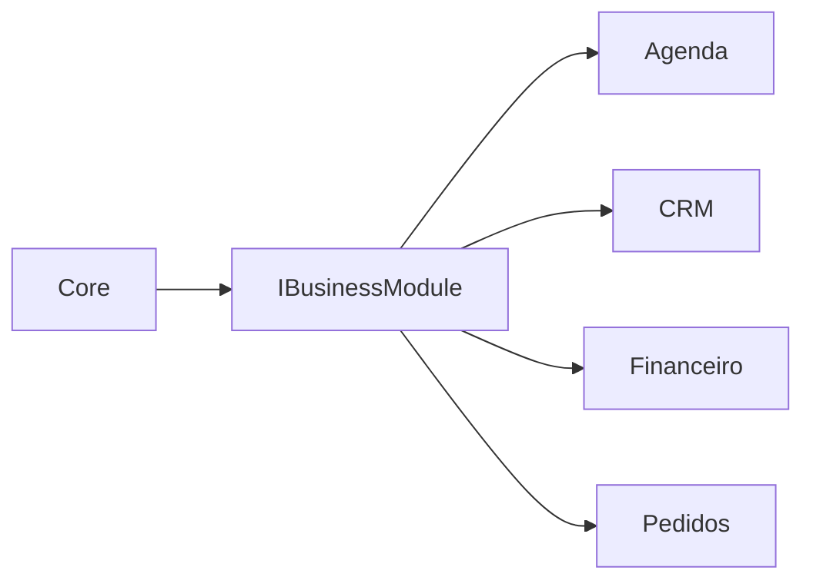
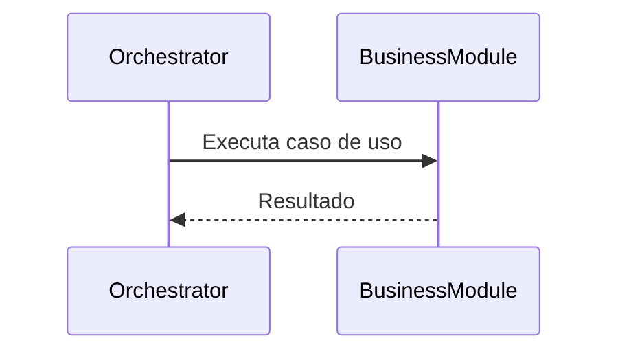

# Business Modules

**Versão:** 1.0

**Status:** Estável

---

# Resumo

| Item          | Valor                       |
| ------------- | --------------------------- |
| Categoria     | Extensão                    |
| Tipo          | Executor                    |
| Estado        | Estável                     |
| Introduzido   | Architecture v1.0           |
| Depende de    | Contrato de Business Module |
| Utilizado por | Orchestrator                |

---

# 1. Objetivo

Os Business Modules representam os domínios de negócio das aplicações construídas sobre o Assist Engine.

Seu objetivo é encapsular toda a lógica específica de um domínio, permitindo que o Core permaneça completamente independente das regras da aplicação.

Cada módulo representa um domínio funcional e pode evoluir de forma independente, sem modificar a arquitetura do Assist Engine.

---

# 2. Papel na Arquitetura

Os Business Modules são executores especializados em domínios de negócio.

Quando selecionado pelo Decision Engine, o módulo executa a lógica correspondente ao seu domínio e devolve um resultado padronizado ao Orchestrator.

---

# 3. Responsabilidades

Compete exclusivamente aos Business Modules:

* implementar regras específicas do domínio;
* executar casos de uso da aplicação;
* coordenar serviços pertencentes ao domínio;
* aplicar políticas de negócio;
* produzir resultados padronizados para o Core.

Toda regra de negócio deve permanecer encapsulada dentro do módulo correspondente.

---

# 4. Fora do Escopo

Os Business Modules nunca devem:

* coordenar o fluxo arquitetural;
* selecionar estratégias de execução;
* comunicar-se diretamente com canais de comunicação;
* conhecer provedores de IA;
* modificar o funcionamento do Core;
* implementar infraestrutura compartilhada.

Seu foco exclusivo é o domínio de negócio.

---

# 5. Entradas

Os Business Modules recebem do Orchestrator:

* a requisição;
* o contexto preparado pelo Pipeline;
* as informações necessárias para execução do caso de uso.

O formato da requisição é independente do domínio da aplicação.

---

# 6. Saídas

Após executar o caso de uso, o módulo devolve ao Orchestrator um resultado padronizado.

Esse resultado será posteriormente transformado em uma resposta pelo Response Builder.

---

# 7. O Conceito de Domínio

Um Business Module representa um domínio funcional completo.

Exemplos:

* Agenda;
* CRM;
* Financeiro;
* Pedidos;
* Estoque;
* Atendimento;
* Catálogo de Produtos.

Cada módulo possui autonomia para organizar sua estrutura interna.

Para o Assist Engine, entretanto, todos são vistos apenas como implementações do mesmo contrato arquitetural.

---

# 8. Estrutura Interna

A organização interna de um Business Module não faz parte da arquitetura do Assist Engine.

Cada módulo pode conter elementos como:

* entidades;
* casos de uso;
* serviços de domínio;
* repositórios;
* validações;
* políticas;
* objetos de valor.

Essa estrutura pertence exclusivamente ao domínio da aplicação.

O Core permanece completamente independente dessa organização.

---

# 9. Independência do Core

O Assist Engine nunca possui conhecimento sobre os domínios de negócio.

O Core conhece apenas o contrato arquitetural.

As implementações concretas pertencem à aplicação.

Essa separação garante que o Assist Engine permaneça reutilizável em qualquer domínio.

---

# 10. Dependências Permitidas

Os Business Modules podem conhecer:

* contratos do Core;
* modelos internos da requisição;
* modelos internos do resultado;
* serviços pertencentes ao domínio;
* infraestrutura específica da aplicação.

Essas dependências permanecem restritas ao domínio representado pelo módulo.

---

# 11. Dependências Proibidas

Os Business Modules nunca devem conhecer diretamente:

* canais de comunicação;
* Pipeline;
* Decision Engine;
* Orchestrator;
* Response Builder;
* implementações concretas de outros módulos.

A comunicação entre módulos deve ocorrer por contratos bem definidos, evitando acoplamento entre domínios.

---

# 12. Ciclo de Vida

Os Business Modules participam apenas durante a execução da estratégia selecionada.

Após devolver o resultado ao Orchestrator, sua participação é encerrada.

---

# 13. Regras Arquiteturais

Os Business Modules devem obedecer às seguintes regras:

* representar exatamente um domínio de negócio;
* encapsular toda a lógica pertencente ao domínio;
* comunicar-se com o Core apenas por contratos;
* nunca alterar o fluxo arquitetural;
* nunca conhecer canais de comunicação;
* permanecer independentes entre si.

Essas regras preservam a modularidade e evitam o acoplamento entre domínios.

---

# 14. Possíveis Evoluções

A arquitetura permite diversas evoluções para os Business Modules.

Entre elas:

* novos domínios de negócio;
* módulos carregados dinamicamente;
* versionamento de módulos;
* módulos distribuídos;
* módulos desenvolvidos por terceiros;
* catálogo de módulos reutilizáveis.

Essas evoluções não alteram a responsabilidade principal do componente.

---

# 15. Relação com os Demais Executores

Os Business Modules diferenciam-se dos demais executores porque não representam uma capacidade técnica do Assist Engine.

Enquanto:

* o Rule Engine executa regras determinísticas;
* o Tool Engine executa capacidades do sistema;
* o AI Engine executa capacidades de linguagem natural;

os Business Modules executam regras específicas do domínio da aplicação.

Essa separação mantém o Core genérico e reutilizável, permitindo que o mesmo Assist Engine seja utilizado em projetos completamente diferentes.

---

# 16. Considerações Finais

Os Business Modules representam o ponto de extensão do Assist Engine para diferentes domínios de negócio.

Ao isolar toda a lógica específica da aplicação em módulos independentes, a arquitetura preserva um Core pequeno, desacoplado e reutilizável.

Esse princípio estabelece uma clara separação entre o motor de conversação e as regras de negócio das aplicações construídas sobre ele, permitindo que ambos evoluam de forma independente e mantendo o Assist Engine fiel ao seu objetivo de ser uma plataforma genérica para desenvolvimento de assistentes inteligentes.
