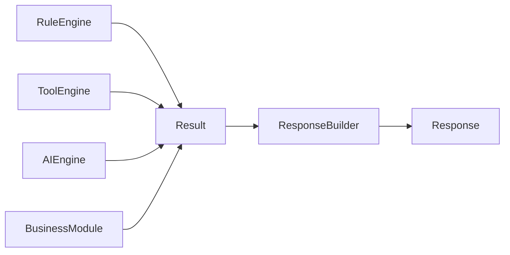
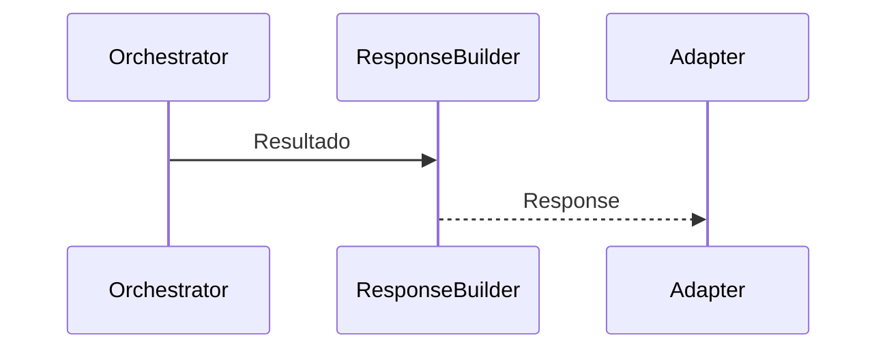

    # Response Builder

**Versão:** 1.0

**Status:** Estável

---

# Resumo

| Item          | Valor                                    |
| ------------- | ---------------------------------------- |
| Categoria     | Core                                     |
| Tipo          | Componente                               |
| Estado        | Estável                                  |
| Introduzido   | Architecture v1.0                        |
| Depende de    | Modelos internos de Resultado e Response |
| Utilizado por | Orchestrator                             |

---

# 1. Objetivo

O Response Builder é o componente responsável por transformar o resultado produzido pelos executores em uma resposta padronizada do Assist Engine.

Seu objetivo é estabelecer um único contrato de saída para o Core, garantindo que todas as respostas produzidas pelo sistema possuam uma representação uniforme, independentemente da estratégia de execução utilizada.

O Response Builder representa o ponto final do processamento interno de uma requisição.

---

# 2. Papel na Arquitetura

O Response Builder encerra o fluxo do Core.

Independentemente do executor responsável pelo processamento da requisição, toda saída obrigatoriamente passa pelo Response Builder antes de retornar ao Adapter Layer.

---

# 3. Responsabilidades

Compete exclusivamente ao Response Builder:

* receber o resultado produzido pelo executor;
* transformar esse resultado em uma Response padronizada;
* garantir consistência entre todas as respostas produzidas pelo Core;
* preparar a resposta para retorno ao Adapter Layer.

O Response Builder não interpreta regras de negócio nem altera o resultado produzido pelo executor.

---

# 4. Fora do Escopo

O Response Builder nunca deve:

* executar regras de negócio;
* interpretar linguagem natural;
* comunicar-se com modelos de IA;
* executar ferramentas;
* selecionar estratégias;
* coordenar o fluxo arquitetural;
* converter respostas para formatos específicos de canais.

Essas responsabilidades pertencem a outros componentes da arquitetura.

---

# 5. Entradas

O Response Builder recebe exclusivamente o resultado produzido por um executor.

Esse resultado pode ter origem em:

* Rule Engine;
* Tool Engine;
* AI Engine;
* Business Module;
* Human Handoff.

Para o Response Builder, a origem do resultado é irrelevante.

Seu único compromisso é construir uma Response consistente.

---

# 6. Saídas

O Response Builder produz exclusivamente um objeto Response.

Esse objeto representa o contrato oficial de saída do Core.

A partir desse momento, todos os componentes da infraestrutura passam a trabalhar apenas com essa representação padronizada.

---

# 7. O Contrato de Saída do Core

O Assist Engine estabelece que apenas o Response Builder é responsável por produzir uma Response.

Essa separação garante que todos os executores permaneçam focados exclusivamente em resolver suas respectivas responsabilidades.

---

# 8. Independência dos Executores

O Response Builder não possui conhecimento sobre o funcionamento interno dos executores.

Ele conhece apenas o contrato do resultado produzido.

Essa característica permite adicionar novos executores sem necessidade de alterar o Response Builder.

A única exigência arquitetural é que o novo executor produza um resultado compatível com o contrato definido pelo Core.

---

# 9. Dependências Permitidas

O Response Builder pode conhecer:

* modelos internos de Result;
* modelo Response;
* contratos de saída do Core;
* componentes auxiliares relacionados à construção da resposta.

Essas dependências permanecem restritas ao processo de padronização da resposta.

---

# 10. Dependências Proibidas

O Response Builder nunca deve conhecer diretamente:

* Rule Engine;
* Tool Engine;
* AI Engine;
* Business Modules;
* canais de comunicação;
* provedores de IA;
* infraestrutura de transporte.

Seu papel limita-se exclusivamente à construção da Response.

---

# 11. Ciclo de Vida

O Response Builder participa apenas do encerramento do processamento interno.

Após construir a Response, sua participação é encerrada.

---

# 12. Regras Arquiteturais

O Response Builder deve obedecer às seguintes regras:

* produzir sempre uma Response padronizada;
* nunca alterar a estratégia utilizada pelo executor;
* nunca executar lógica de negócio;
* nunca conhecer canais de comunicação;
* nunca depender de implementações concretas dos executores.

Essas regras preservam o desacoplamento entre o Core e a infraestrutura.

---

# 13. Relação com os Executores

Os executores resolvem problemas.

O Response Builder constrói respostas.

Essa distinção representa um dos princípios fundamentais da arquitetura do Assist Engine.

Nenhum executor deve produzir diretamente uma Response.

Toda resposta enviada ao usuário deve ser construída exclusivamente pelo Response Builder.

---

# 14. Possíveis Evoluções

A arquitetura permite diversas evoluções para o Response Builder.

Entre elas:

* composição de múltiplos elementos de resposta;
* suporte a respostas multimodais;
* enriquecimento de metadados;
* padronização internacionalizada;
* políticas de formatação;
* templates reutilizáveis;
* suporte a respostas parciais.

Essas evoluções não alteram a responsabilidade principal do componente.

---

# 15. Relação com o Adapter Layer

O Response Builder representa a fronteira final do Core.

Após produzir uma Response padronizada, toda responsabilidade retorna à infraestrutura.

O Adapter Layer passa então a converter essa Response para o formato esperado pelo canal de comunicação.

Essa separação garante que o Core permaneça completamente independente das tecnologias utilizadas pelos canais.

---

# 16. Considerações Finais

O Response Builder estabelece o contrato oficial de saída do Assist Engine.

Ao centralizar a construção das respostas em um único componente, a arquitetura elimina duplicações, reduz acoplamentos e garante consistência entre todas as estratégias de execução.

Essa abordagem reforça um dos princípios fundamentais do projeto: os executores existem para produzir resultados; somente o Response Builder é responsável por transformá-los na resposta que será enviada ao usuário.
