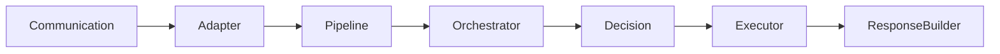
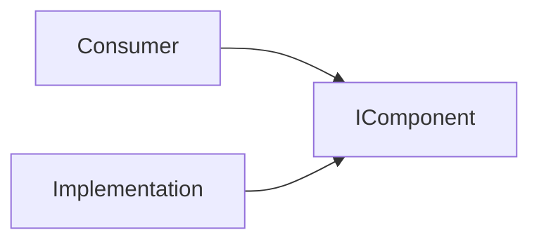

# 10. Inclusão de Novos Componentes

A arquitetura do Assist Engine foi projetada para evoluir de forma incremental.

Novos componentes poderão ser adicionados ao longo do desenvolvimento sem comprometer a estabilidade do sistema, desde que respeitem os princípios arquiteturais definidos na versão 1.0.

Esta seção estabelece os critérios que devem orientar a criação de qualquer novo componente.

---

# 10.1 Objetivo

O objetivo desta seção é definir um processo arquitetural para inclusão de novos componentes no Assist Engine.

Antes da implementação de qualquer novo elemento, deve-se avaliar sua responsabilidade, seus relacionamentos e seu impacto sobre a arquitetura existente.

O surgimento de um novo componente deve representar uma necessidade arquitetural claramente identificada, e não apenas uma decisão de implementação.

---

# 10.2 Quando Criar um Novo Componente

Um novo componente deve ser criado apenas quando existir uma responsabilidade que não possa ser atribuída a um componente existente sem violar o princípio da responsabilidade única.

A criação de componentes não deve ser utilizada para fragmentar excessivamente a arquitetura nem para evitar refatorações.

Antes de criar um novo componente, deve-se verificar se a funcionalidade proposta realmente representa uma nova responsabilidade arquitetural.

---

# 10.3 Critérios de Inclusão

Todo novo componente deve responder claramente às seguintes perguntas.

| Pergunta                                | Objetivo                                   |
| --------------------------------------- | ------------------------------------------ |
| Qual responsabilidade ele possui?       | Definir sua função na arquitetura.         |
| Qual problema arquitetural ele resolve? | Justificar sua existência.                 |
| Quem pode conhecê-lo?                   | Definir suas dependências permitidas.      |
| Quem ele pode conhecer?                 | Limitar seu acoplamento.                   |
| Quais contratos implementa ou consome?  | Garantir comunicação por abstrações.       |
| Em qual etapa do fluxo atua?            | Posicioná-lo corretamente no Request Flow. |
| A qual camada pertence?                 | Preservar a organização arquitetural.      |

Caso essas perguntas não possam ser respondidas de forma objetiva, o componente ainda não está suficientemente definido.

---

# 10.4 Posicionamento na Arquitetura

Todo novo componente deve integrar-se à arquitetura existente sem alterar sua direção.

A inclusão de um novo componente nunca deve modificar esse fluxo sem uma decisão arquitetural formal.

Sempre que possível, ele deve ser incorporado utilizando contratos já existentes ou por meio da criação de novos contratos especializados.

---

# 10.5 Comunicação por Contratos

Novos componentes devem comunicar-se preferencialmente por contratos arquiteturais.

Dependências diretas entre implementações concretas devem ser evitadas.

Caso um novo componente introduza comunicação direta com implementações, sua arquitetura deve ser reavaliada.

---

# 10.6 Avaliação de Dependências

Antes da inclusão de um novo componente, recomenda-se verificar:

* quais dependências ele necessita;
* quais componentes poderão conhecê-lo;
* quais componentes ele poderá conhecer;
* se existem dependências circulares;
* se sua comunicação ocorre por contratos;
* se respeita a independência do Core.

Essa análise reduz o risco de introduzir acoplamentos desnecessários.

---

# 10.7 Evolução Incremental

O Assist Engine adota uma estratégia de evolução incremental.

Isso significa que novos componentes devem complementar a arquitetura existente, e não modificar seu comportamento fundamental.

A introdução de novas capacidades deve ocorrer por extensão e composição, preservando os princípios arquiteturais estabelecidos.

---

# 10.8 Situações que Justificam um Novo Componente

A criação de um novo componente pode ser apropriada quando:

* surge uma nova responsabilidade arquitetural;
* um componente existente passa a concentrar responsabilidades distintas;
* uma nova capacidade precisa ser reutilizada em diferentes contextos;
* a separação melhora significativamente o desacoplamento da arquitetura.

Essas situações indicam que a evolução da arquitetura está ocorrendo de maneira saudável.

---

# 10.9 Situações que Não Justificam um Novo Componente

A criação de um novo componente não deve ocorrer apenas porque:

* um arquivo tornou-se grande;
* existe preferência pessoal por determinada organização;
* uma implementação específica parece complexa;
* deseja-se evitar uma refatoração;
* uma funcionalidade será utilizada apenas uma vez.

Essas situações normalmente devem ser resolvidas dentro da estrutura arquitetural existente.

---

# 10.10 Checklist Arquitetural

Antes de aprovar um novo componente, recomenda-se responder às seguintes perguntas.

* Ele possui uma única responsabilidade?
* Resolve um problema arquitetural claramente identificado?
* Respeita a direção das dependências?
* Comunica-se por contratos?
* Mantém o Core independente da infraestrutura?
* Evita dependências circulares?
* Pode evoluir de forma independente?

Caso alguma resposta seja negativa, sua inclusão deve ser reavaliada.

---

# 10.11 Considerações Finais

A arquitetura do Assist Engine foi concebida para crescer sem perder sua simplicidade.

A inclusão de novos componentes deve ocorrer de forma criteriosa, preservando os princípios definidos na Architecture v1.0 e evitando o aumento desnecessário da complexidade.

Ao exigir que cada novo componente possua uma responsabilidade claramente definida, dependências controladas e comunicação baseada em contratos, a arquitetura permanece modular, previsível e preparada para evoluir continuamente, independentemente das tecnologias ou domínios de negócio adotados pelas aplicações que utilizam o Assist Engine.
