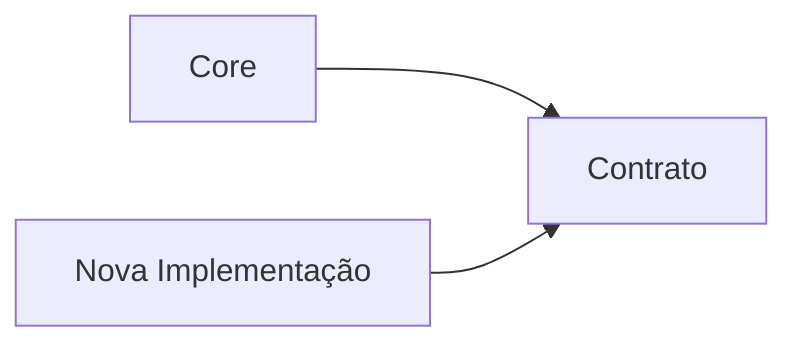

# 12. Evolução das Dependências

A arquitetura do Assist Engine foi concebida para evoluir continuamente sem comprometer os princípios estabelecidos na versão 1.0.

Essa evolução não ocorre pela flexibilização das regras arquiteturais, mas pela incorporação de novas capacidades preservando os mesmos fundamentos de desacoplamento, modularidade e comunicação por contratos.

Esta seção estabelece as diretrizes que orientam a evolução das dependências ao longo do ciclo de vida do projeto.

---

# 12.1 Objetivo

O objetivo desta seção é definir como as dependências arquiteturais podem evoluir à medida que o Assist Engine incorpora novos componentes, tecnologias e capacidades.

A evolução da arquitetura deve ocorrer de forma incremental e controlada, preservando a estabilidade do Core e evitando que novas necessidades resultem em aumento desnecessário do acoplamento entre os componentes.

---

# 12.2 Princípio da Estabilidade Arquitetural

Os princípios fundamentais da arquitetura são considerados estáveis.

Novos componentes, contratos ou estratégias devem adaptar-se à arquitetura existente, e não modificar seus fundamentos.

Isso significa que características como comunicação por contratos, responsabilidade única, direção das dependências e independência do Core permanecem válidas independentemente da evolução do sistema.

---

# 12.3 Evolução por Extensão

O Assist Engine prioriza a evolução por extensão.

Novas capacidades devem ser incorporadas por meio da adição de componentes especializados, novas implementações ou novos contratos, evitando alterações nos componentes já consolidados.

Essa abordagem reduz o impacto das mudanças e preserva a estabilidade dos componentes existentes.

---

# 12.4 Evolução dos Contratos

Os contratos representam os pontos de estabilidade da arquitetura.

Sempre que possível, novas funcionalidades devem reutilizar contratos existentes.

Quando isso não for suficiente, novos contratos devem ser introduzidos de forma específica e independente, evitando alterações incompatíveis em contratos amplamente utilizados.

Essa estratégia reduz o impacto da evolução sobre os consumidores já existentes.

---

# 12.5 Evolução dos Componentes

Os componentes podem evoluir internamente desde que suas responsabilidades arquiteturais permaneçam inalteradas.

Mudanças de implementação não devem modificar:

* suas responsabilidades;
* seus contratos públicos;
* suas dependências permitidas;
* sua posição no fluxo arquitetural.

Essa separação permite evolução contínua sem afetar a arquitetura.

---

# 12.6 Evolução Tecnológica

A arquitetura foi projetada para permitir a substituição de tecnologias sem impacto sobre o Core.

Mudanças como:

* substituição de provedores de IA;
* inclusão de novos canais de comunicação;
* adoção de novas ferramentas;
* alteração de bibliotecas ou frameworks;

devem permanecer restritas às implementações concretas, preservando os contratos definidos pela arquitetura.

---

# 12.7 Compatibilidade Arquitetural

Toda evolução deve preservar a compatibilidade com os princípios definidos na Architecture v1.0.

Sempre que uma mudança exigir:

* inversão da direção das dependências;
* comunicação direta entre implementações;
* quebra da responsabilidade única;
* aumento do conhecimento entre componentes;

a decisão deve ser analisada sob a perspectiva arquitetural antes de ser implementada.

Nem toda evolução técnica representa uma evolução arquitetural.

---

# 12.8 Crescimento Sustentável

Uma arquitetura sustentável não é aquela que permanece imutável, mas aquela que consegue crescer mantendo sua organização.

No Assist Engine, isso significa que novas capacidades devem ampliar o sistema sem aumentar proporcionalmente sua complexidade.

A evolução deve ocorrer por composição, especialização e extensão, preservando os limites estabelecidos entre os componentes.

---

# 12.9 Indicadores de Evolução Saudável

A evolução da arquitetura pode ser considerada saudável quando:

* novos componentes reutilizam contratos existentes;
* implementações podem ser substituídas sem impacto no Core;
* o número de dependências permanece controlado;
* não surgem dependências circulares;
* os componentes mantêm responsabilidades bem definidas.

Esses indicadores demonstram que a arquitetura continua coerente com seus princípios originais.

---

# 12.10 Considerações Finais

A evolução das dependências deve preservar a identidade arquitetural do Assist Engine.

O crescimento do sistema não deve resultar em aumento progressivo do acoplamento, mas na ampliação controlada de suas capacidades por meio de contratos estáveis, componentes especializados e responsabilidades bem definidas.

Ao adotar essa estratégia, o Assist Engine mantém sua arquitetura preparada para incorporar novas tecnologias e domínios de aplicação sem comprometer os princípios que fundamentam sua versão 1.0.
