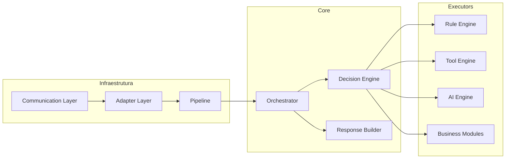
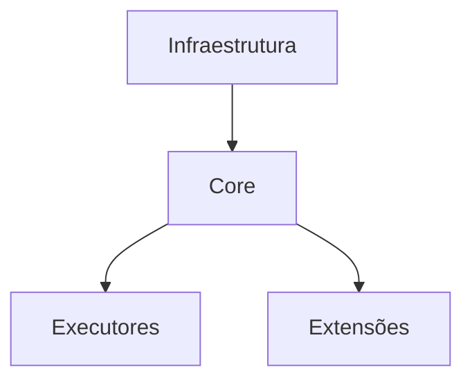
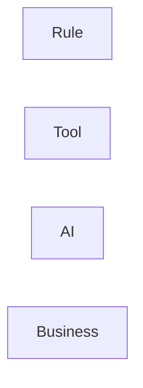

# 3. Visão Geral das Dependências

Esta seção apresenta uma visão consolidada das dependências arquiteturais do Assist Engine.

Seu objetivo é demonstrar como os componentes se relacionam entre si, evidenciando a direção permitida das dependências e a separação existente entre infraestrutura, Core, serviços e extensões.

As relações apresentadas representam **dependências arquiteturais**, e não chamadas de métodos, troca de mensagens ou detalhes de implementação.

---

# 3.1 Mapa Geral de Dependências

O diagrama abaixo apresenta a direção permitida das dependências entre os principais componentes da arquitetura.



As setas representam exclusivamente dependências arquiteturais permitidas.

Elas não indicam necessariamente chamadas diretas entre implementações concretas.

Sempre que possível, essas dependências devem ocorrer por meio de contratos definidos pelo Core.

---

# 3.2 Direção das Dependências

Uma característica fundamental do Assist Engine é que as dependências possuem direção única.

Nenhum componente pode estabelecer dependências que retornem para componentes anteriores do fluxo arquitetural.

Por exemplo:

```text
Communication
        │
        ▼
Adapter
        │
        ▼
Pipeline
        │
        ▼
Orchestrator
```

é permitido.

Entretanto:

```text
Pipeline
        │
        ▼
Communication
```

representa uma inversão da arquitetura e não é permitido.

Essa regra elimina dependências circulares e preserva a organização da solução.

---

# 3.3 Agrupamento Arquitetural

As dependências respeitam também os limites entre as categorias arquiteturais.



Cada categoria possui responsabilidades específicas e limites claramente definidos.

As dependências nunca devem violar esses limites.

---

# 3.4 Independência entre Executores

Os executores representam estratégias independentes de processamento.

Por esse motivo, eles não estabelecem dependências entre si.



Não existem relações como:

* Rule Engine → Tool Engine
* Tool Engine → AI Engine
* AI Engine → Business Modules
* Business Modules → Rule Engine

Cada executor recebe uma requisição do Orchestrator, executa sua responsabilidade e devolve um resultado padronizado.

Essa independência permite que novas estratégias sejam adicionadas sem impactar as já existentes.

---

# 3.5 O Core como Centro Arquitetural

O Core atua como o ponto de coordenação da arquitetura.

Entretanto, isso não significa que todos os componentes dependam diretamente uns dos outros.


Cada componente conhece apenas os contratos necessários para cumprir sua responsabilidade.

Essa organização impede a formação de um núcleo excessivamente acoplado.

---

# 3.6 Comunicação por Contratos

Embora o diagrama apresente dependências entre componentes, a comunicação ocorre preferencialmente por contratos.

Por exemplo:

```text
Orchestrator
        │
        ▼
IDecisionEngine
```

e não:

```text
Orchestrator
        │
        ▼
DecisionEngineImpl
```

O mesmo princípio aplica-se a:

* AI Providers;
* Tools;
* Business Modules;
* Pipeline Steps;
* demais extensões da arquitetura.

Essa abordagem reduz o acoplamento e facilita substituições futuras.

---

# 3.7 Fronteiras Arquiteturais

A arquitetura do Assist Engine estabelece fronteiras bem definidas entre seus grupos de componentes.


Cada fronteira representa um ponto de isolamento da arquitetura.

Nenhum componente pode ultrapassar essas fronteiras ignorando os contratos definidos pelo sistema.

---

# 3.8 Evolução das Dependências

O mapa de dependências apresentado nesta seção representa a estrutura arquitetural da versão 1.0 do Assist Engine.

Novos componentes poderão ser incorporados futuramente.

Entretanto, qualquer evolução deverá preservar os princípios definidos neste documento, especialmente:

* direção única das dependências;
* ausência de dependências circulares;
* comunicação por contratos;
* independência do Core;
* responsabilidade única dos componentes.

Esses princípios garantem que a arquitetura possa evoluir continuamente sem comprometer sua organização ou aumentar o acoplamento entre seus componentes.
