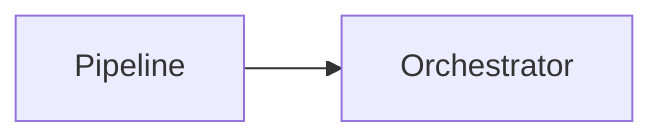
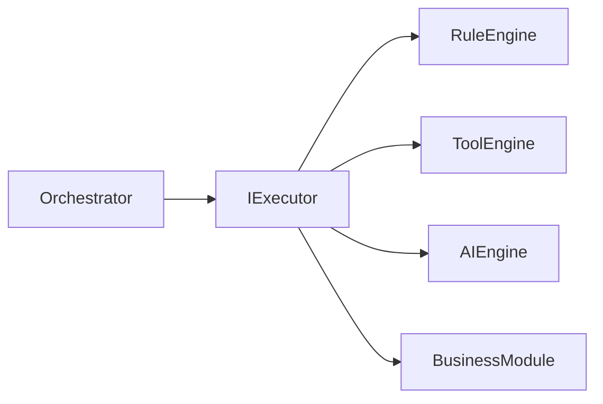
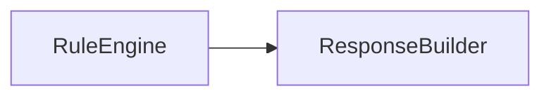
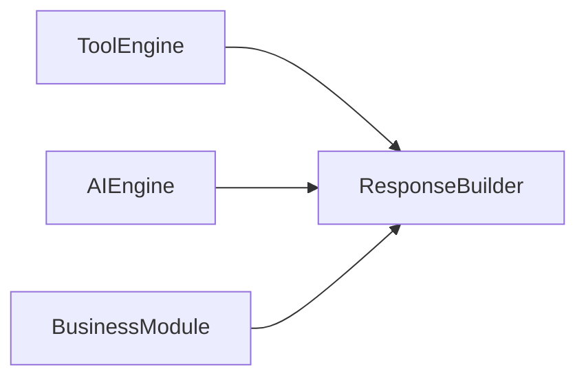

# 4. Tipos de Dependência

Nem toda relação entre componentes possui o mesmo significado arquitetural.

No Assist Engine, as dependências são classificadas em categorias distintas para deixar explícito o nível de acoplamento existente entre dois componentes.

Essa classificação permite compreender não apenas **quem pode conhecer quem**, mas também **como esse conhecimento deve ocorrer**.

Ao distinguir os diferentes tipos de dependência, a arquitetura reduz ambiguidades durante a implementação e estabelece limites claros para evolução do sistema.

---

# 4.1 Dependência Permitida

Uma dependência permitida ocorre quando um componente pode conhecer outro componente ou um de seus contratos como parte de sua responsabilidade arquitetural.

Essa relação deve existir apenas quando for indispensável para o funcionamento da arquitetura.



Nesse exemplo, o Pipeline pode conhecer o contrato do Orchestrator porque sua responsabilidade termina ao entregar a requisição preparada para o Core.

A existência dessa dependência está prevista pela arquitetura.

Entretanto, uma dependência permitida não autoriza o conhecimento da implementação concreta do componente.

Sempre que possível, a comunicação deve ocorrer por meio de contratos.

---

# 4.2 Dependência por Contrato

A dependência por contrato representa o tipo de relacionamento preferencial adotado pelo Assist Engine.

Nessa abordagem, um componente conhece apenas uma abstração definida pelo Core.

A implementação concreta permanece completamente desacoplada.

```text
Orchestrator
        │
        ▼
IDecisionEngine
```

e nunca:

```text
Orchestrator
        │
        ▼
DecisionEngineImpl
```

Esse mesmo princípio aplica-se a diversos componentes da arquitetura.

Exemplos:

```text
AI Engine
        │
        ▼
IAIProvider
```

```text
Tool Engine
        │
        ▼
ITool
```

```text
Pipeline
        │
        ▼
IPipelineStep
```

```text
Core
        │
        ▼
IBusinessModule
```

Essa forma de dependência oferece diversas vantagens:

* reduz o acoplamento entre componentes;
* permite substituir implementações sem alterar o Core;
* facilita testes unitários;
* favorece extensibilidade;
* preserva a independência tecnológica da arquitetura.

Sempre que possível, este deve ser o modelo de dependência utilizado no Assist Engine.

---

# 4.3 Dependência Proibida

Uma dependência proibida representa uma relação que viola os princípios arquiteturais do Assist Engine.

Essas dependências nunca devem existir na implementação.

Exemplos:

```text
Communication Layer
        │
        ▼
AI Engine
```

```text
Rule Engine
        │
        ▼
OpenAI Provider
```

```text
Adapter Layer
        │
        ▼
Decision Engine
```

```text
Business Module
        │
        ▼
Communication Layer
```

Essas relações quebram o isolamento entre as camadas da arquitetura e aumentam significativamente o acoplamento do sistema.

Sempre que uma dependência proibida parecer necessária, a arquitetura deve ser reavaliada antes da implementação.

---

# 4.4 Dependência Direta

Uma dependência direta ocorre quando um componente conhece explicitamente outro componente permitido pela arquitetura.

Exemplo:


Esse tipo de dependência é utilizado quando existe uma relação arquitetural claramente definida entre os componentes.

Mesmo nesses casos, recomenda-se que a comunicação ocorra por contratos sempre que possível.

---

# 4.5 Dependência Indireta

Uma dependência indireta ocorre quando um componente se relaciona com outro apenas por intermédio de contratos ou componentes intermediários.

Exemplo:



Nesse cenário, o Orchestrator não conhece nenhum executor concreto.

Seu conhecimento limita-se ao contrato comum compartilhado por todos.

Esse tipo de dependência reduz significativamente o impacto causado pela inclusão de novos executores.

---

# 4.6 Dependência de Fluxo

É importante distinguir dependência arquitetural de fluxo de processamento.

O fato de uma informação percorrer dois componentes não significa que exista dependência direta entre eles.

Por exemplo:



O resultado produzido pelo Rule Engine chega ao Response Builder.

Entretanto, o Response Builder não possui conhecimento sobre o Rule Engine.

Ele conhece apenas o contrato do resultado recebido.

Da mesma forma:



Todos os executores compartilham o mesmo contrato de saída.

Isso elimina dependências entre o Response Builder e os executores concretos.

---

# 4.7 Dependência Arquitetural versus Dependência Tecnológica

O Assist Engine distingue claramente dependências arquiteturais de dependências tecnológicas.

Dependência arquitetural:

```text
AI Engine
        │
        ▼
IAIProvider
```

Dependência tecnológica:

```text
OpenAI SDK

Claude SDK

Gemini SDK
```

As dependências tecnológicas pertencem às implementações concretas e não fazem parte da arquitetura do Core.

Esse princípio preserva a independência tecnológica do Assist Engine e facilita a substituição de bibliotecas, frameworks e provedores externos.

---

# 4.8 Hierarquia das Dependências

A arquitetura estabelece uma ordem de preferência entre os tipos de dependência.

Da mais recomendada para a menos recomendada:

| Prioridade | Tipo                                   |
| ---------- | -------------------------------------- |
| 1          | Dependência por Contrato               |
| 2          | Dependência Direta (quando necessária) |
| 3          | Dependência Indireta                   |
| ❌          | Dependência Proibida                   |

Essa hierarquia orienta as decisões de implementação e contribui para preservar o baixo acoplamento da arquitetura.

Sempre que houver mais de uma alternativa, deve-se optar pela que produzir o menor nível de acoplamento entre os componentes.

---

# 4.9 Considerações Finais

A classificação apresentada nesta seção define como os componentes do Assist Engine podem estabelecer relações entre si.

Mais importante do que permitir dependências é definir seus limites.

Ao privilegiar contratos, abstrações e relações de baixo acoplamento, a arquitetura mantém o Core independente das implementações concretas e preparada para evoluir continuamente sem comprometer sua organização interna.

As próximas seções utilizarão essa classificação para definir, de forma objetiva, quais dependências são permitidas entre cada componente do Assist Engine.
