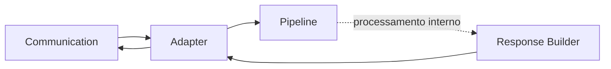

# Adapter Layer

---

# Objetivo

Este documento define as dependências permitidas e proibidas do Adapter Layer.

Seu objetivo é preservar a separação entre a infraestrutura de comunicação e o modelo interno do Assist Engine, garantindo que o processo de adaptação permaneça isolado do Core e de suas decisões arquiteturais.

As regras aqui descritas complementam a documentação do componente, especificando exclusivamente seus relacionamentos arquiteturais.

---

# Visão Geral

O Adapter Layer ocupa uma posição única na arquitetura.

É o único componente autorizado a conhecer simultaneamente:

* o formato utilizado pelos canais de comunicação;
* o modelo interno utilizado pelo Assist Engine.

Essa característica faz do Adapter Layer a fronteira entre o mundo externo e o Core.


---

# Dependências Permitidas

O Adapter Layer pode conhecer apenas os seguintes elementos.

| Dependência                                | Tipo           | Justificativa                               |
| ------------------------------------------ | -------------- | ------------------------------------------- |
| Communication Layer                        | Direta         | Recebimento e envio de mensagens.           |
| Pipeline                                   | Contrato       | Encaminhamento da requisição normalizada.   |
| Modelos internos (Message, Response, etc.) | Contrato       | Conversão entre formatos externo e interno. |
| Estruturas específicas dos canais          | Infraestrutura | Conversão dos eventos recebidos.            |

Toda dependência adicional deve ser considerada proibida até que uma decisão arquitetural estabeleça o contrário.

---

# Dependências Proibidas

O Adapter Layer nunca deve conhecer diretamente:

| Componente       | Motivo                                          |
| ---------------- | ----------------------------------------------- |
| Orchestrator     | Coordenação pertence ao Core.                   |
| Decision Engine  | Tomada de decisão pertence ao Core.             |
| Rule Engine      | O Adapter não executa estratégias.              |
| Tool Engine      | O Adapter não executa capacidades.              |
| AI Engine        | O Adapter não possui responsabilidade sobre IA. |
| Business Modules | O Adapter não conhece domínios de negócio.      |
| Response Builder | A construção da resposta pertence ao Core.      |

Essas restrições garantem que o Adapter permaneça exclusivamente responsável pela adaptação entre modelos.

---

# Comunicação Permitida

O Adapter Layer comunica-se apenas com os componentes imediatamente adjacentes ao fluxo arquitetural.


Nenhuma comunicação direta com componentes do Core é permitida.

---

# Comunicação por Contratos

A comunicação do Adapter Layer deve ocorrer preferencialmente por contratos arquiteturais.

Exemplos:

```text
Adapter Layer
        │
        ▼
IPipeline
```

```text
Adapter Layer
        │
        ▼
Message
```

```text
Adapter Layer
        │
        ▼
Response
```

Essa abordagem garante que alterações na implementação do Pipeline ou dos modelos internos não afetem o processo de adaptação.

---

# Fluxo Arquitetural

O Adapter Layer participa exclusivamente da entrada e da saída de uma requisição.



Durante o processamento interno do Assist Engine, o Adapter permanece completamente desacoplado do Core.

---

# Restrições Arquiteturais

O Adapter Layer deve obedecer às seguintes restrições.

* Nunca executar lógica de negócio.
* Nunca interpretar intenções.
* Nunca selecionar estratégias de execução.
* Nunca acessar executores.
* Nunca comunicar-se diretamente com o Decision Engine.
* Nunca conhecer provedores de IA.
* Nunca acessar Tools.
* Nunca acessar Business Modules.

Seu único propósito é adaptar representações de dados.

---

# Justificativa Arquitetural

O Adapter Layer constitui uma das principais barreiras de isolamento da arquitetura.

Ao concentrar todas as conversões entre formatos externos e o modelo interno em um único componente, elimina a necessidade de que qualquer outro elemento do Assist Engine conheça detalhes específicos dos canais de comunicação.

Esse isolamento preserva a independência tecnológica do Core e permite incorporar novos canais sem modificar a arquitetura interna.

---

# Checklist Arquitetural

Antes de adicionar uma nova dependência ao Adapter Layer, responda às seguintes perguntas:

* Essa dependência participa do processo de adaptação?
* Ela pertence à infraestrutura de comunicação?
* Ela pode ser substituída por um contrato?
* Ela introduz conhecimento sobre regras de negócio?
* Ela aproxima o Adapter do Core?

Caso alguma resposta seja negativa, a dependência não deve ser adicionada.

---

# Considerações Finais

O Adapter Layer estabelece uma fronteira arquitetural entre os canais de comunicação e o modelo interno do Assist Engine.

Ao limitar rigorosamente suas dependências, garante que todo o restante da arquitetura permaneça completamente independente das tecnologias utilizadas para comunicação, preservando o baixo acoplamento e a modularidade definidos na Architecture v1.0.
