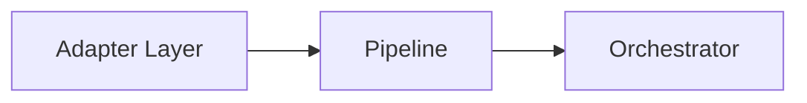
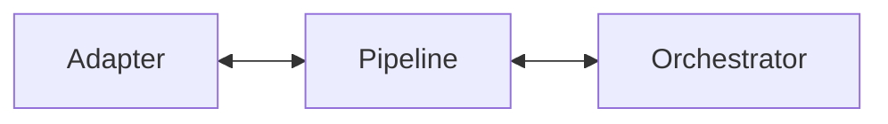

# Pipeline

---

# Objetivo

Este documento define as dependências permitidas e proibidas do Pipeline.

Seu objetivo é garantir que o Pipeline permaneça exclusivamente responsável pela preparação técnica das requisições, preservando sua independência em relação ao Core, às estratégias de execução e aos domínios de negócio.

As regras aqui descritas complementam a documentação do componente, especificando exclusivamente seus relacionamentos arquiteturais.

---

# Visão Geral

O Pipeline representa a última etapa da infraestrutura antes da entrada da requisição no Core.

Sua posição arquitetural estabelece uma fronteira clara entre a preparação técnica da requisição e seu processamento funcional.



---

# Dependências Permitidas

O Pipeline pode conhecer apenas os seguintes elementos.

| Dependência                         | Tipo     | Justificativa                                        |
| ----------------------------------- | -------- | ---------------------------------------------------- |
| Adapter Layer                       | Direta   | Recebimento da requisição normalizada.               |
| Orchestrator                        | Contrato | Encaminhamento da requisição preparada.              |
| Pipeline Steps                      | Contrato | Execução das etapas técnicas de preparação.          |
| Modelos internos da requisição      | Contrato | Enriquecimento e validação da requisição.            |
| Serviços técnicos de infraestrutura | Contrato | Operações técnicas necessárias durante a preparação. |

O Pipeline nunca deve depender de componentes responsáveis pelo processamento funcional da requisição.

---

# Dependências Proibidas

O Pipeline nunca deve conhecer diretamente:

| Componente       | Motivo                                           |
| ---------------- | ------------------------------------------------ |
| Decision Engine  | O Pipeline não toma decisões.                    |
| Rule Engine      | O Pipeline não executa regras.                   |
| Tool Engine      | O Pipeline não executa capacidades.              |
| AI Engine        | O Pipeline não utiliza IA.                       |
| Business Modules | O Pipeline não conhece domínios de negócio.      |
| Response Builder | O Pipeline atua apenas na entrada da requisição. |

Essas restrições preservam a separação entre preparação técnica e processamento funcional.

---

# Comunicação Permitida

O Pipeline comunica-se exclusivamente com os componentes imediatamente adjacentes ao fluxo arquitetural.



Internamente, comunica-se apenas com seus próprios Pipeline Steps.

Nenhuma comunicação direta com executores é permitida.

---

# Comunicação por Contratos

Toda comunicação realizada pelo Pipeline deve ocorrer por contratos arquiteturais.

Exemplos:

```text
Pipeline
        │
        ▼
IOrchestrator
```

```text
Pipeline
        │
        ▼
IPipelineStep
```

```text
Pipeline Step
        │
        ▼
Request
```

Os Pipeline Steps nunca devem conhecer uns aos outros.

Cada Step comunica-se apenas com o Pipeline por meio do contrato estabelecido.

---

# Fluxo Arquitetural

O Pipeline recebe uma requisição normalizada, executa suas etapas técnicas e entrega a requisição preparada ao Orchestrator.


Após encaminhar a requisição ao Core, sua participação é encerrada.

---

# Restrições Arquiteturais

O Pipeline deve obedecer às seguintes restrições.

* Nunca executar lógica de negócio.
* Nunca interpretar linguagem natural.
* Nunca selecionar estratégias de execução.
* Nunca acessar executores.
* Nunca conhecer Business Modules.
* Nunca construir respostas.
* Nunca alterar o fluxo arquitetural.

Cada Pipeline Step deve possuir responsabilidade única e executar exclusivamente tarefas técnicas.

---

# Justificativa Arquitetural

O Pipeline concentra todas as responsabilidades técnicas necessárias para preparar uma requisição antes de sua entrada no Core.

Ao limitar rigorosamente suas dependências, impede que decisões de negócio ou estratégias de execução sejam incorporadas às etapas de preparação.

Essa separação preserva a simplicidade do componente e facilita sua evolução incremental por meio da adição ou remoção de Pipeline Steps independentes.

---

# Checklist Arquitetural

Antes de adicionar uma nova dependência ao Pipeline, responda às seguintes perguntas:

* Essa dependência participa da preparação técnica da requisição?
* Ela pode ser implementada como um Pipeline Step?
* Ela introduz conhecimento sobre regras de negócio?
* Ela toma alguma decisão arquitetural?
* Ela depende de um executor?

Caso alguma resposta seja positiva para as duas últimas perguntas, a dependência não deve ser adicionada ao Pipeline.

---

# Considerações Finais

O Pipeline deve permanecer um componente estritamente técnico, responsável apenas pela preparação da requisição.

Ao limitar suas dependências aos elementos necessários para essa preparação, preserva a separação entre infraestrutura e Core, evita o crescimento indevido de responsabilidades e garante que toda decisão arquitetural continue concentrada nos componentes apropriados.

Essa disciplina é fundamental para manter o Assist Engine modular, previsível e alinhado aos princípios definidos na Architecture v1.0.
