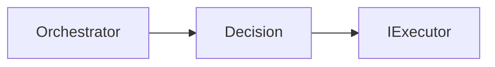
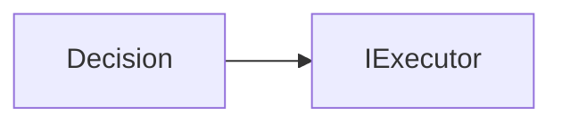
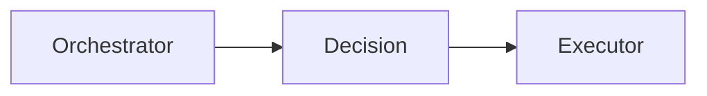

# Decision Engine

---

# Objetivo

Este documento define as dependências permitidas e proibidas do Decision Engine.

Seu objetivo é garantir que o mecanismo de tomada de decisão permaneça completamente desacoplado das implementações concretas dos executores, preservando sua responsabilidade exclusiva de selecionar uma estratégia de execução.

As regras aqui descritas complementam a documentação do componente, especificando exclusivamente seus relacionamentos arquiteturais.

---

# Visão Geral

O Decision Engine ocupa uma posição estratégica no Core.

Sua função é analisar a requisição e determinar qual estratégia de execução deverá ser utilizada.

Apesar dessa responsabilidade, ele não possui conhecimento sobre o funcionamento interno dos executores.



Sua decisão sempre resulta na seleção de um contrato de execução.

---

# Dependências Permitidas

O Decision Engine pode conhecer apenas os seguintes elementos.

| Dependência                               | Tipo     | Justificativa                      |
| ----------------------------------------- | -------- | ---------------------------------- |
| Executor                                  | Contrato | Seleção da estratégia de execução. |
| Políticas de decisão                      | Contrato | Aplicação das regras de seleção.   |
| Modelos internos (Request, Context, etc.) | Contrato | Análise da requisição.             |

Nenhuma implementação concreta de executor deve ser conhecida.

---

# Dependências Proibidas

O Decision Engine nunca deve conhecer diretamente:

| Componente          | Motivo                                           |
| ------------------- | ------------------------------------------------ |
| Communication Layer | Infraestrutura não participa da decisão.         |
| Adapter Layer       | Conversão de formatos pertence à infraestrutura. |
| Pipeline            | A preparação da requisição já foi concluída.     |
| Orchestrator        | O fluxo é coordenado externamente.               |
| Rule Engine         | Deve conhecer apenas o contrato do Executor.     |
| Tool Engine         | Deve conhecer apenas o contrato do Executor.     |
| AI Engine           | Deve conhecer apenas o contrato do Executor.     |
| Business Modules    | Deve conhecer apenas o contrato do Executor.     |
| Response Builder    | A construção da resposta ocorre após a execução. |
| AI Providers        | Implementações pertencem à infraestrutura.       |
| Tools               | Capacidades concretas pertencem ao Tool Engine.  |

Essas restrições garantem que a decisão permaneça independente da implementação da estratégia escolhida.

---

# Comunicação Permitida

O Decision Engine comunica-se exclusivamente por contratos.



Nenhuma comunicação direta com implementações concretas é permitida.

---

# Comunicação por Contratos

Toda decisão produzida pelo Decision Engine deve referenciar apenas contratos arquiteturais.

Exemplos:

```text
IExecutor

IDecisionPolicy
```

Essa abordagem permite incorporar novos executores sem modificar o mecanismo de decisão.

---

# Fluxo Arquitetural

O Decision Engine participa exclusivamente da seleção da estratégia.



Após devolver a estratégia selecionada, sua participação é encerrada.

---

# Restrições Arquiteturais

O Decision Engine deve obedecer às seguintes restrições.

* Nunca executar estratégias.
* Nunca conhecer implementações concretas.
* Nunca comunicar-se com infraestrutura.
* Nunca acessar AI Providers.
* Nunca acessar Tools.
* Nunca construir respostas.
* Nunca coordenar o fluxo arquitetural.

Sua única responsabilidade é selecionar uma estratégia de execução.

---

# Justificativa Arquitetural

O Decision Engine constitui o mecanismo de tomada de decisão do Assist Engine.

Ao limitar suas dependências exclusivamente aos contratos dos executores, a arquitetura preserva a independência entre decidir e executar.

Essa separação permite que novas estratégias sejam adicionadas sem alterar o mecanismo responsável por selecioná-las.

---

# Checklist Arquitetural

Antes de adicionar uma nova dependência ao Decision Engine, responda às seguintes perguntas:

* Essa dependência influencia a tomada de decisão?
* Ela representa apenas um contrato?
* Ela introduz conhecimento sobre implementações concretas?
* Ela altera a responsabilidade de decidir?
* Ela depende de infraestrutura?

Caso alguma resposta seja positiva para as duas últimas perguntas, a dependência não deve ser adicionada.

---

# Considerações Finais

O Decision Engine possui um conjunto reduzido de dependências porque sua responsabilidade limita-se à seleção da estratégia de execução.

Ao conhecer exclusivamente contratos e políticas de decisão, preserva o desacoplamento entre a tomada de decisão e a execução das estratégias, permitindo que o Assist Engine evolua continuamente sem comprometer sua arquitetura.
