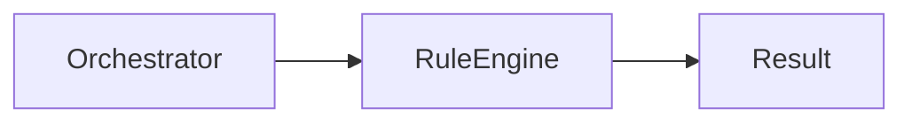
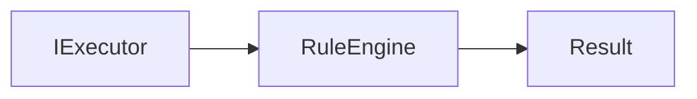
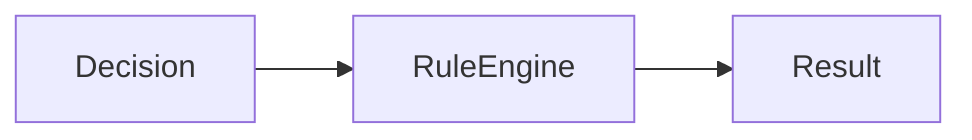

# Rule Engine

---

# Objetivo

Este documento define as dependências permitidas e proibidas do Rule Engine.

Seu objetivo é garantir que o Rule Engine permaneça responsável exclusivamente pela execução de regras determinísticas, preservando sua independência em relação à infraestrutura, aos demais executores e às implementações externas.

As regras aqui descritas complementam a documentação do componente, especificando exclusivamente seus relacionamentos arquiteturais.

---

# Visão Geral

O Rule Engine é um executor especializado em conhecimento determinístico.

Sua atuação limita-se à execução das regras previamente definidas, produzindo um resultado padronizado para o Core.



O Rule Engine não estabelece relações com os demais executores.

---

# Dependências Permitidas

O Rule Engine pode conhecer apenas os seguintes elementos.

| Dependência                                      | Tipo     | Justificativa                                       |
| ------------------------------------------------ | -------- | --------------------------------------------------- |
| Contrato do Executor                             | Contrato | Implementação da estratégia de execução.            |
| Contratos de Regras                              | Contrato | Execução das regras determinísticas.                |
| Modelos internos (Request, Context e Result)     | Contrato | Processamento da requisição e retorno do resultado. |
| Componentes auxiliares de domínio determinístico | Contrato | Suporte à avaliação das regras.                     |

Todas as dependências devem permanecer independentes da infraestrutura.

---

# Dependências Proibidas

O Rule Engine nunca deve conhecer diretamente:

| Componente          | Motivo                                           |
| ------------------- | ------------------------------------------------ |
| Communication Layer | Infraestrutura não participa da execução.        |
| Adapter Layer       | Conversão de formatos pertence à infraestrutura. |
| Pipeline            | A preparação da requisição já foi concluída.     |
| Orchestrator        | O fluxo é coordenado externamente.               |
| Decision Engine     | A estratégia já foi selecionada.                 |
| Tool Engine         | Executores permanecem independentes.             |
| AI Engine           | Regras determinísticas não utilizam IA.          |
| Business Modules    | Domínios de negócio permanecem isolados.         |
| Response Builder    | O Rule Engine produz apenas um Result.           |
| AI Providers        | Não utiliza Inteligência Artificial.             |
| Tools               | Não executa capacidades externas.                |

Essas restrições preservam o isolamento entre os executores.

---

# Comunicação Permitida

O Rule Engine comunica-se exclusivamente por contratos arquiteturais.



Seu resultado será posteriormente processado pelo Response Builder, sem que exista dependência direta entre ambos.

---

# Comunicação por Contratos

O Rule Engine comunica-se apenas por contratos definidos pelo Core.

Exemplos:

```text id="ov7ylm"
IExecutor

IRule

Request

Result
```

Essa abordagem permite evoluir o mecanismo de regras sem impactar outros componentes da arquitetura.

---

# Fluxo Arquitetural

O Rule Engine participa apenas da execução da estratégia selecionada.



Após produzir o resultado, sua participação é encerrada.

---

# Restrições Arquiteturais

O Rule Engine deve obedecer às seguintes restrições.

* Nunca selecionar estratégias.
* Nunca executar Tools.
* Nunca utilizar IA.
* Nunca conhecer outros executores.
* Nunca construir respostas.
* Nunca comunicar-se com infraestrutura.
* Nunca acessar canais de comunicação.

Sua responsabilidade limita-se exclusivamente à execução de regras determinísticas.

---

# Justificativa Arquitetural

O Rule Engine representa a estratégia de execução mais simples e previsível do Assist Engine.

Ao restringir suas dependências ao mínimo necessário, a arquitetura garante alta previsibilidade, baixo custo computacional e facilidade de testes.

Essa separação reforça o princípio arquitetural de utilizar Inteligência Artificial apenas quando regras determinísticas não forem suficientes.

---

# Checklist Arquitetural

Antes de adicionar uma nova dependência ao Rule Engine, responda às seguintes perguntas:

* Essa dependência participa da execução das regras?
* Ela pode ser representada por um contrato?
* Ela introduz conhecimento sobre infraestrutura?
* Ela depende de outro executor?
* Ela exige Inteligência Artificial?

Caso alguma resposta seja positiva para as duas últimas perguntas, a dependência não deve ser adicionada.

---

# Considerações Finais

O Rule Engine possui um conjunto mínimo de dependências porque sua responsabilidade é extremamente específica.

Ao permanecer completamente isolado da infraestrutura, dos demais executores e das implementações concretas, mantém o comportamento determinístico esperado pela arquitetura e reforça um dos princípios fundamentais do Assist Engine: resolver problemas pela estratégia mais simples possível antes de recorrer a mecanismos mais complexos.
