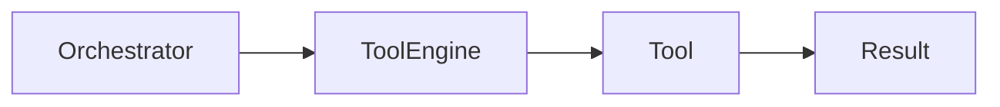
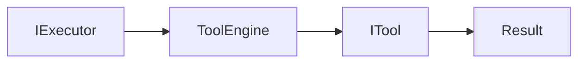
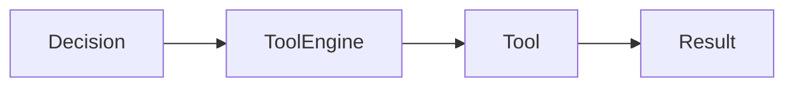

# Tool Engine

---

# Objetivo

Este documento define as dependências permitidas e proibidas do Tool Engine.

Seu objetivo é garantir que o Tool Engine permaneça responsável exclusivamente pela execução de Tools, preservando sua independência em relação à infraestrutura, aos demais executores e às regras de negócio da aplicação.

As regras aqui descritas complementam a documentação do componente, especificando exclusivamente seus relacionamentos arquiteturais.

---

# Visão Geral

O Tool Engine é um executor especializado na utilização de capacidades disponibilizadas ao Assist Engine por meio de Tools.

Sua responsabilidade limita-se a localizar, executar e devolver o resultado produzido pela Tool selecionada.



O Tool Engine não participa da tomada de decisão nem da coordenação do fluxo arquitetural.

---

# Dependências Permitidas

O Tool Engine pode conhecer apenas os seguintes elementos.

| Dependência                                  | Tipo     | Justificativa                                       |
| -------------------------------------------- | -------- | --------------------------------------------------- |
| Contrato do Executor                         | Contrato | Implementação da estratégia de execução.            |
| Contratos de Tools (`ITool`)                 | Contrato | Execução das capacidades registradas.               |
| Registro de Tools                            | Contrato | Localização das capacidades disponíveis.            |
| Modelos internos (Request, Context e Result) | Contrato | Processamento da requisição e retorno do resultado. |

As Tools representam capacidades do sistema e devem ser acessadas exclusivamente por seus contratos.

---

# Dependências Proibidas

O Tool Engine nunca deve conhecer diretamente:

| Componente                        | Motivo                                           |
| --------------------------------- | ------------------------------------------------ |
| Communication Layer               | Infraestrutura não participa da execução.        |
| Adapter Layer                     | Conversão de formatos pertence à infraestrutura. |
| Pipeline                          | A preparação da requisição já foi concluída.     |
| Orchestrator                      | O fluxo é coordenado externamente.               |
| Decision Engine                   | A estratégia já foi selecionada.                 |
| Rule Engine                       | Executores permanecem independentes.             |
| AI Engine                         | Executores permanecem independentes.             |
| Business Modules                  | Domínios de negócio permanecem isolados.         |
| Response Builder                  | O Tool Engine produz apenas um Result.           |
| Implementações concretas de Tools | Devem ser acessadas apenas por contratos.        |

Essas restrições preservam o desacoplamento entre o Core e as capacidades do sistema.

---

# Comunicação Permitida

O Tool Engine comunica-se exclusivamente por contratos arquiteturais.



Toda execução ocorre por meio do contrato da Tool.

---

# Comunicação por Contratos

O Tool Engine comunica-se apenas por abstrações definidas pelo Core.

Exemplos:

```text
IExecutor

ITool

IToolRegistry

Request

Result
```

Essa abordagem permite adicionar, remover ou substituir Tools sem alterar o Tool Engine.

---

# Fluxo Arquitetural

O Tool Engine participa apenas da execução da estratégia selecionada.



Após produzir o resultado, sua participação é encerrada.

---

# Restrições Arquiteturais

O Tool Engine deve obedecer às seguintes restrições.

* Nunca selecionar estratégias.
* Nunca implementar regras de negócio.
* Nunca conhecer outros executores.
* Nunca comunicar-se diretamente com infraestrutura.
* Nunca utilizar provedores de IA.
* Nunca construir respostas.
* Nunca acessar canais de comunicação.

Sua responsabilidade limita-se exclusivamente à execução de capacidades representadas por Tools.

---

# Justificativa Arquitetural

O Tool Engine representa o mecanismo responsável por executar capacidades disponibilizadas ao Assist Engine.

Ao depender exclusivamente de contratos de Tools, a arquitetura permite que novas capacidades sejam incorporadas ao sistema sem alterar o Core ou o próprio Tool Engine.

Essa decisão preserva o baixo acoplamento, favorece a extensibilidade e reforça o princípio arquitetural de que uma Tool representa uma capacidade do sistema, e não uma regra de negócio.

---

# Checklist Arquitetural

Antes de adicionar uma nova dependência ao Tool Engine, responda às seguintes perguntas:

* Essa dependência representa uma capacidade do sistema?
* Ela pode ser acessada por um contrato?
* Ela introduz conhecimento sobre infraestrutura?
* Ela depende de outro executor?
* Ela implementa regra de negócio?

Caso alguma resposta seja positiva para as três últimas perguntas, a dependência não deve ser adicionada.

---

# Considerações Finais

O Tool Engine permanece completamente desacoplado da infraestrutura e das implementações concretas das Tools.

Ao conhecer apenas contratos e modelos internos do Core, garante que novas capacidades possam ser adicionadas ao Assist Engine de forma incremental, preservando a modularidade da arquitetura e mantendo clara a separação entre execução de capacidades e regras de negócio.
