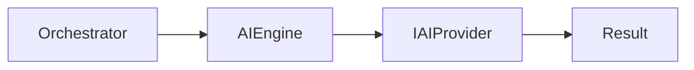
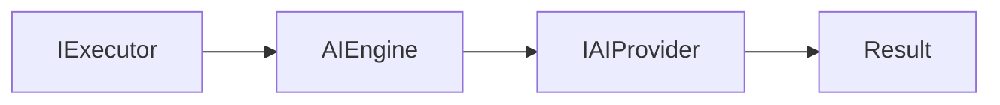
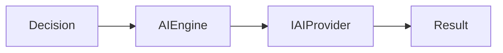

# AI Engine

---

# Objetivo

Este documento define as dependências permitidas e proibidas do AI Engine.

Seu objetivo é garantir que o AI Engine permaneça responsável exclusivamente pela utilização de capacidades de Inteligência Artificial, preservando sua independência em relação aos provedores, à infraestrutura e aos demais executores.

As regras aqui descritas complementam a documentação do componente, especificando exclusivamente seus relacionamentos arquiteturais.

---

# Visão Geral

O AI Engine é um executor especializado em processamento de linguagem natural.

Sua responsabilidade limita-se a utilizar um AI Provider por meio de contratos definidos pelo Core e devolver um resultado padronizado ao Assist Engine.



O AI Engine permanece completamente independente das implementações concretas dos provedores.

---

# Dependências Permitidas

O AI Engine pode conhecer apenas os seguintes elementos.

| Dependência                                  | Tipo     | Justificativa                                       |
| -------------------------------------------- | -------- | --------------------------------------------------- |
| Contrato do Executor                         | Contrato | Implementação da estratégia de execução.            |
| Contrato de AI Provider (`IAIProvider`)      | Contrato | Processamento por Inteligência Artificial.          |
| Registro de AI Providers                     | Contrato | Localização do provedor configurado.                |
| Modelos internos (Request, Context e Result) | Contrato | Processamento da requisição e retorno do resultado. |

Todas as dependências devem permanecer independentes da implementação dos provedores.

---

# Dependências Proibidas

O AI Engine nunca deve conhecer diretamente:

| Componente                                                         | Motivo                                           |
| ------------------------------------------------------------------ | ------------------------------------------------ |
| Communication Layer                                                | Infraestrutura não participa da execução.        |
| Adapter Layer                                                      | Conversão de formatos pertence à infraestrutura. |
| Pipeline                                                           | A preparação da requisição já foi concluída.     |
| Orchestrator                                                       | O fluxo é coordenado externamente.               |
| Decision Engine                                                    | A estratégia já foi selecionada.                 |
| Rule Engine                                                        | Executores permanecem independentes.             |
| Tool Engine                                                        | Executores permanecem independentes.             |
| Business Modules                                                   | Domínios de negócio permanecem isolados.         |
| Response Builder                                                   | O AI Engine produz apenas um Result.             |
| OpenAI, Claude, Gemini, Ollama ou qualquer outro provedor concreto | O AI Engine conhece apenas contratos.            |

Essas restrições preservam a independência tecnológica da arquitetura.

---

# Comunicação Permitida

O AI Engine comunica-se exclusivamente por contratos arquiteturais.



Toda comunicação com modelos de IA ocorre por meio do contrato do provedor.

---

# Comunicação por Contratos

O AI Engine comunica-se apenas por abstrações definidas pelo Core.

Exemplos:

```text id="w4y8y7"
IExecutor

IAIProvider

IAIProviderRegistry

Request

Result
```

Essa abordagem permite substituir provedores sem qualquer alteração no AI Engine.

---

# Fluxo Arquitetural

O AI Engine participa apenas da execução da estratégia selecionada.



Após produzir o resultado, sua participação é encerrada.

---

# Restrições Arquiteturais

O AI Engine deve obedecer às seguintes restrições.

* Nunca selecionar estratégias.
* Nunca conhecer implementações concretas de provedores.
* Nunca conhecer outros executores.
* Nunca comunicar-se diretamente com infraestrutura de comunicação.
* Nunca executar Tools.
* Nunca construir respostas.
* Nunca acessar canais de comunicação.

Sua responsabilidade limita-se exclusivamente à utilização da capacidade de processamento de linguagem natural disponibilizada pelos AI Providers.

---

# Justificativa Arquitetural

O AI Engine representa a abstração arquitetural responsável pela utilização de Inteligência Artificial.

Ao depender exclusivamente de contratos de AI Providers, preserva a independência tecnológica do Assist Engine e permite incorporar novos modelos ou substituir provedores existentes sem alterar o Core.

Essa decisão está alinhada ao princípio arquitetural de que a Inteligência Artificial é uma capacidade especializada do sistema, e não o elemento central da arquitetura.

---

# Checklist Arquitetural

Antes de adicionar uma nova dependência ao AI Engine, responda às seguintes perguntas:

* Essa dependência representa uma capacidade de IA?
* Ela pode ser acessada por um contrato?
* Ela introduz conhecimento sobre um provedor específico?
* Ela depende de outro executor?
* Ela aumenta o acoplamento com infraestrutura?

Caso alguma resposta seja positiva para as três últimas perguntas, a dependência não deve ser adicionada.

---

# Considerações Finais

O AI Engine permanece completamente desacoplado dos provedores concretos de Inteligência Artificial.

Ao comunicar-se exclusivamente por contratos, garante que a arquitetura permaneça independente de fornecedores, preparada para incorporar novas tecnologias e alinhada aos princípios de baixo acoplamento definidos na Architecture v1.0.

Essa abordagem reforça uma das principais características do Assist Engine: a Inteligência Artificial é apenas uma capacidade da arquitetura, nunca uma dependência estrutural do Core.
