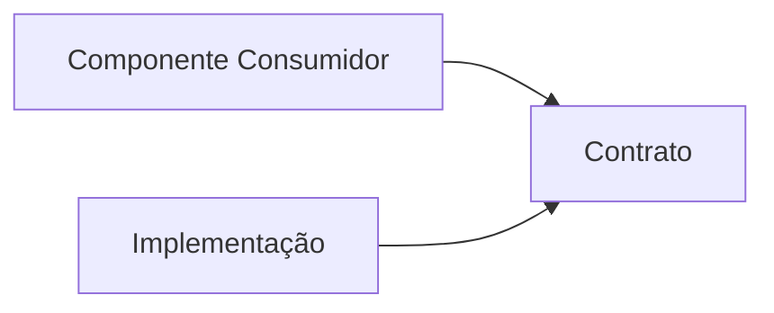
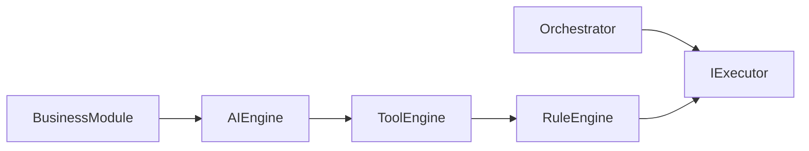

# 7. Comunicação por Contratos

A comunicação entre os componentes do Assist Engine ocorre, sempre que possível, por meio de contratos arquiteturais.

Esse princípio estabelece que os componentes conheçam apenas as capacidades necessárias para cumprir sua responsabilidade, permanecendo independentes das implementações concretas.

Ao adotar contratos como mecanismo padrão de comunicação, a arquitetura reduz o acoplamento, facilita a substituição de implementações e preserva a estabilidade do Core durante sua evolução.

---

# 7.1 Objetivo

O objetivo da comunicação por contratos é garantir que a relação entre dois componentes seja estabelecida exclusivamente por abstrações arquiteturais.

Os componentes nunca devem depender diretamente de implementações concretas quando existir um contrato capaz de representar a mesma capacidade.

Essa abordagem permite que diferentes implementações coexistam sem alterar a arquitetura.

---

# 7.2 O Conceito de Contrato

Um contrato define **o que** um componente oferece, sem revelar **como** essa funcionalidade é implementada.



O consumidor conhece apenas o contrato.

A implementação conhece o contrato que deve cumprir.

Nenhum dos dois depende diretamente do outro.

---

# 7.3 Contratos como Fronteiras Arquiteturais

Os contratos representam fronteiras entre os componentes do Assist Engine.

Eles estabelecem limites claros de comunicação e impedem que detalhes internos de implementação sejam propagados pela arquitetura.



O Orchestrator nunca precisa conhecer qual executor será utilizado.

Seu conhecimento limita-se ao contrato compartilhado.

---

# 7.4 Dependência de Abstrações

O Assist Engine adota o princípio de depender de abstrações, e não de implementações concretas.

Por exemplo:

Permitido:

```text id="3xh0n8"
AI Engine
        │
        ▼
IAIProvider
```

Não permitido:

```text id="g3d5hl"
AI Engine
        │
        ▼
OpenAIProvider
```

O mesmo princípio aplica-se a todos os componentes da arquitetura.

---

# 7.5 Contratos Utilizados na Arquitetura

A arquitetura define contratos para representar as principais capacidades do sistema.

| Contrato           | Responsabilidade                                    |
| ------------------ | --------------------------------------------------- |
| `IOrchestrator`    | Coordenação do fluxo arquitetural.                  |
| `IDecisionEngine`  | Seleção da estratégia de execução.                  |
| `IExecutor`        | Execução de uma estratégia.                         |
| `IPipelineStep`    | Execução de uma etapa técnica do Pipeline.          |
| `ITool`            | Representação de uma capacidade do sistema.         |
| `IAIProvider`      | Comunicação com modelos de Inteligência Artificial. |
| `IBusinessModule`  | Representação de um domínio de negócio.             |
| `IResponseBuilder` | Construção da resposta padronizada.                 |

Novos contratos poderão ser adicionados à arquitetura sempre que representarem uma capacidade claramente definida.

---

# 7.6 Benefícios Arquiteturais

A comunicação por contratos proporciona diversos benefícios.

* reduz o acoplamento entre componentes;
* facilita testes unitários;
* permite substituir implementações sem alterar consumidores;
* favorece reutilização;
* simplifica a evolução incremental da arquitetura;
* preserva a independência tecnológica do Core.

Esses benefícios justificam sua adoção como mecanismo preferencial de comunicação.

---

# 7.7 Limites da Comunicação por Contratos

Embora recomendada para praticamente toda a arquitetura, a comunicação por contratos não elimina completamente as dependências.

Os componentes continuam dependendo das abstrações definidas pelo Core.

Entretanto, esse tipo de dependência é considerado estável, pois representa capacidades arquiteturais e não detalhes tecnológicos.

Essa distinção é fundamental para preservar a modularidade do Assist Engine.

---

# 7.8 Evolução dos Contratos

Os contratos devem evoluir com cautela.

Sempre que um contrato precisar ser modificado, deve-se avaliar o impacto sobre todos os componentes que o utilizam.

Alterações incompatíveis devem ser evitadas.

Quando necessário, novos contratos devem ser introduzidos em vez de modificar contratos amplamente utilizados.

Essa abordagem reduz o impacto da evolução da arquitetura.

---

# 7.9 Regras Arquiteturais

A comunicação por contratos deve obedecer às seguintes regras.

* Componentes devem conhecer preferencialmente contratos.
* Implementações concretas nunca devem ser expostas ao Core.
* Um contrato deve representar apenas uma capacidade arquitetural.
* Contratos devem permanecer estáveis.
* Implementações podem evoluir independentemente dos consumidores.
* A comunicação deve ocorrer por abstrações sempre que possível.

Essas regras preservam a consistência da arquitetura ao longo de sua evolução.

---

# 7.10 Considerações Finais

A comunicação por contratos constitui um dos pilares arquiteturais do Assist Engine.

Ao estabelecer abstrações como mecanismo padrão de relacionamento entre componentes, a arquitetura reduz significativamente o acoplamento interno, preserva a independência entre implementações e facilita a incorporação de novas capacidades ao sistema.

Esse princípio permeia toda a Architecture v1.0 e garante que a evolução do Assist Engine ocorra de forma incremental, previsível e sustentável, sem comprometer os limites arquiteturais definidos para cada componente.
