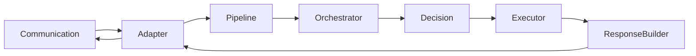
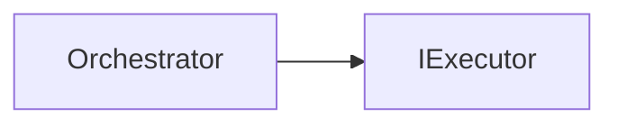
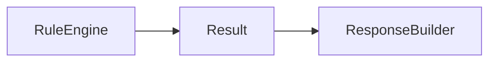
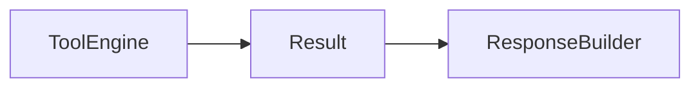
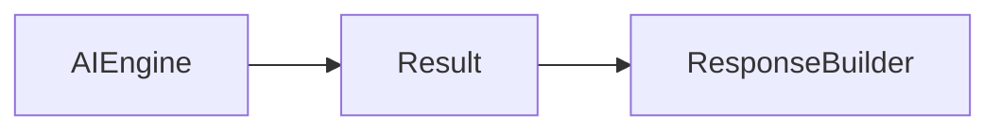
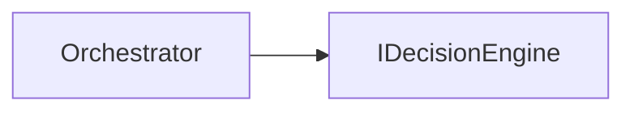
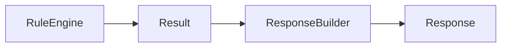

# 8. Fluxo versus Dependência

Uma das distinções mais importantes da arquitetura do Assist Engine é a separação entre **fluxo de execução** e **dependência arquitetural**.

Embora esses conceitos frequentemente apareçam juntos durante a implementação de sistemas, eles representam relações completamente diferentes.

Compreender essa diferença é fundamental para evitar acoplamentos desnecessários e preservar a modularidade da arquitetura.

---

# 8.1 Objetivo

Esta seção estabelece a diferença entre o caminho percorrido por uma requisição durante seu processamento e as dependências existentes entre os componentes da arquitetura.

O fato de uma informação percorrer determinado componente não significa que exista uma dependência direta entre os elementos envolvidos.

No Assist Engine, o fluxo é definido pelo processamento da requisição.

As dependências são definidas exclusivamente pelos contratos arquiteturais.

---

# 8.2 O Fluxo Representa a Execução

O fluxo descreve a sequência pela qual uma requisição percorre os componentes do sistema.



Esse diagrama representa apenas a ordem de execução da requisição.

Ele não descreve quais componentes conhecem uns aos outros.

---

# 8.3 A Dependência Representa Conhecimento

Uma dependência arquitetural indica que um componente possui conhecimento sobre outro componente ou sobre um contrato definido pela arquitetura.

Por exemplo:



Nesse caso, existe uma dependência.

O Orchestrator conhece o contrato `IExecutor`.

Entretanto, ele não conhece qualquer implementação concreta.

---

# 8.4 Fluxo Não Implica Dependência

O simples fato de um dado atravessar dois componentes não estabelece uma relação arquitetural entre eles.

Por exemplo:



O Response Builder recebe um `Result`.

Ele não conhece o Rule Engine.

Da mesma forma:



e



Todos os executores produzem exatamente o mesmo contrato.

Para o Response Builder, a origem desse resultado é irrelevante.

---

# 8.5 Dependência Não Implica Fluxo

Também existe o caso inverso.

Dois componentes podem possuir uma relação arquitetural sem que exista comunicação direta durante todo o fluxo de execução.

Por exemplo:



Essa dependência existe permanentemente na arquitetura.

Entretanto, ela participa apenas de um momento específico do processamento da requisição.

A existência da dependência não significa comunicação contínua.

---

# 8.6 O Papel dos Contratos

Os contratos tornam possível separar fluxo e dependência.



O Response Builder conhece apenas o contrato `Result`.

Independentemente de qual executor produziu esse resultado, o comportamento do componente permanece exatamente o mesmo.

Essa característica reduz significativamente o acoplamento entre os executores e o processo de construção da resposta.

---

# 8.7 Benefícios da Separação

Ao distinguir claramente fluxo e dependência, a arquitetura obtém diversos benefícios.

* redução do acoplamento entre componentes;
* maior reutilização dos contratos;
* facilidade para incorporar novos executores;
* menor impacto causado por alterações internas;
* maior estabilidade da arquitetura;
* simplificação da manutenção.

Essa separação constitui um dos pilares do Assist Engine.

---

# 8.8 Exemplos Arquiteturais

### Exemplo 1

Fluxo:

```text id="5cv8bw"
Rule Engine

↓

Response Builder
```

Dependência:

```text id="mjl1or"
Rule Engine

↓

Result

↑

Response Builder
```

Os dois componentes compartilham apenas um contrato.

---

### Exemplo 2

Fluxo:

```text id="8o6aof"
AI Engine

↓

Response Builder
```

Dependência:

```text id="rhtjlwm"
AI Engine

↓

Result

↑

Response Builder
```

O Response Builder continua completamente independente do AI Engine.

---

### Exemplo 3

Fluxo:

```text id="8dnx3w"
Pipeline

↓

Orchestrator
```

Dependência:

```text id="2ikvlg"
Pipeline

↓

IOrchestrator
```

O Pipeline conhece apenas a abstração responsável pela coordenação do Core.

---

# 8.9 Regras Arquiteturais

A arquitetura do Assist Engine estabelece as seguintes regras.

* Fluxo de execução não define dependências.
* Compartilhar dados não implica conhecer implementações.
* Componentes devem comunicar-se por contratos.
* Dependências devem representar conhecimento arquitetural.
* O fluxo deve permanecer independente das implementações concretas.

Essas regras preservam a modularidade da arquitetura e evitam interpretações incorretas durante a implementação.

---

# 8.10 Considerações Finais

O Assist Engine diferencia explicitamente o fluxo de execução das dependências arquiteturais.

Enquanto o fluxo representa o caminho percorrido pela requisição durante seu processamento, as dependências representam exclusivamente o conhecimento necessário para que cada componente cumpra sua responsabilidade.

Essa separação elimina acoplamentos desnecessários, favorece a comunicação por contratos e reforça um dos princípios fundamentais da Architecture v1.0: componentes devem conhecer apenas aquilo que é indispensável para exercer sua função, independentemente do caminho percorrido pela requisição.
