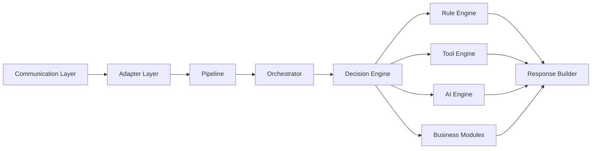

# Components

**Versão:** 1.0

**Status:** Estável

---

# 1. Objetivo

Esta documentação descreve todos os componentes arquiteturais que compõem o Assist Engine.

Enquanto o documento **Architecture v1.0** apresenta a arquitetura em alto nível e o **Request Flow** descreve como uma requisição percorre o sistema, esta seção detalha individualmente cada componente da arquitetura.

O objetivo é definir claramente as responsabilidades, limites, dependências e contratos arquiteturais de cada elemento do sistema, servindo como referência para implementação, manutenção e evolução do projeto.

Nenhum documento desta seção descreve detalhes de implementação, linguagem de programação ou framework. Todas as definições são arquiteturais e permanecem válidas independentemente da tecnologia utilizada.

---

# 2. Organização

Cada componente possui seu próprio documento.

Essa abordagem segue o mesmo princípio arquitetural adotado pelo Assist Engine: **modularidade**.

Cada arquivo descreve apenas um componente, permitindo evolução independente da documentação e facilitando sua consulta durante o desenvolvimento.

A estrutura da documentação é composta pelos seguintes arquivos:

```text
components/
│
├── README.md
├── 01-overview.md
├── 02-communication-layer.md
├── 03-adapter-layer.md
├── 04-pipeline.md
├── 05-orchestrator.md
├── 06-decision-engine.md
├── 07-rule-engine.md
├── 08-tool-engine.md
├── 09-ai-engine.md
├── 10-business-modules.md
├── 11-response-builder.md
├── 12-dependencies/
└── 13-architecture-rules.md
```

Cada documento pode ser lido de forma independente, porém a leitura na ordem apresentada fornece uma compreensão gradual da arquitetura.

---

# 3. Fluxo da Documentação

A documentação acompanha exatamente o caminho percorrido por uma requisição dentro do Assist Engine.



Essa organização permite compreender o sistema seguindo a mesma sequência utilizada durante o processamento de uma requisição.

---

# 4. Estrutura dos Documentos

Todos os componentes seguem exatamente a mesma estrutura documental.

Essa padronização facilita consultas e reduz ambiguidades durante o desenvolvimento.

Cada documento contém as seguintes seções.

## Resumo

Apresenta uma visão rápida do componente.

Inclui:

* categoria;
* tipo;
* estado;
* dependências;
* componentes consumidores.

---

## Objetivo

Define o propósito do componente dentro da arquitetura.

Responde à pergunta:

> Por que este componente existe?

---

## Responsabilidades

Lista as responsabilidades que pertencem exclusivamente ao componente.

Todo comportamento descrito nessa seção deve permanecer restrito ao próprio componente.

---

## Fora do Escopo

Define explicitamente aquilo que o componente **não deve fazer**.

Essa seção é tão importante quanto a lista de responsabilidades, pois impede crescimento indevido e acoplamento entre componentes.

---

## Entradas

Descreve quais informações o componente pode receber.

---

## Saídas

Descreve quais informações o componente produz para o restante da arquitetura.

---

## Dependências Permitidas

Relaciona os componentes e contratos que podem ser utilizados.

Toda dependência não documentada deve ser considerada proibida.

---

## Dependências Proibidas

Relaciona componentes que nunca deverão ser conhecidos diretamente.

Essa regra preserva o baixo acoplamento do Assist Engine.

---

## Ciclo de Vida

Descreve quando o componente é criado, utilizado e descartado durante uma requisição.

---

## Regras Arquiteturais

Define restrições específicas daquele componente.

Essas regras possuem caráter normativo e devem ser respeitadas por qualquer implementação.

---

## Possíveis Evoluções

Apresenta oportunidades futuras de expansão do componente sem modificar os princípios da arquitetura.

Essa seção não representa funcionalidades obrigatórias.

---

# 5. Classificação dos Componentes

Os componentes do Assist Engine estão organizados conforme seu papel arquitetural.

| Componente          | Categoria      | Papel                                   |
| ------------------- | -------------- | --------------------------------------- |
| Communication Layer | Infraestrutura | Entrada e saída de mensagens            |
| Adapter Layer       | Infraestrutura | Conversão entre canais e modelo interno |
| Pipeline            | Infraestrutura | Preparação técnica da requisição        |
| Orchestrator        | Core           | Coordenação do fluxo                    |
| Decision Engine     | Core           | Seleção da estratégia de execução       |
| Rule Engine         | Core           | Processamento determinístico            |
| Tool Engine         | Serviço        | Execução de ferramentas                 |
| AI Engine           | Serviço        | Integração com modelos de IA            |
| Business Modules    | Extensão       | Regras específicas do domínio           |
| Response Builder    | Core           | Padronização da resposta                |

Essa classificação não representa camadas da arquitetura, mas sim a função desempenhada por cada componente dentro do sistema.

---

# 6. Convenções Arquiteturais

Todos os documentos desta seção utilizam as mesmas convenções.

## Responsabilidade Única

Cada componente possui um único propósito claramente definido.

Novas responsabilidades devem ser implementadas por novos componentes, e não adicionadas aos já existentes.

---

## Baixo Acoplamento

Os componentes conhecem apenas aquilo que é estritamente necessário para cumprir sua responsabilidade.

---

## Alta Coesão

Todo comportamento relacionado ao componente permanece concentrado nele próprio.

---

## Comunicação por Contratos

Sempre que possível, os componentes comunicam-se por contratos arquiteturais, evitando dependência direta de implementações concretas.

---

## Independência Tecnológica

Nenhum componente depende de frameworks, bibliotecas ou provedores específicos.

Essas decisões pertencem exclusivamente à camada de infraestrutura.

---

## Fluxo Único

Toda requisição percorre a arquitetura seguindo o fluxo definido no documento **Request Flow**.

Componentes individuais nunca alteram esse fluxo.

---

## Estratégia Única de Execução

Conforme definido na arquitetura versão 1.0, cada requisição é atendida por exatamente uma estratégia de execução, escolhida pelo Decision Engine.

Esse princípio garante previsibilidade, simplicidade e facilidade de manutenção.

---

# 7. Relação com os Demais Documentos

Esta documentação complementa os demais documentos arquiteturais do projeto.

| Documento         | Objetivo                                    |
| ----------------- | ------------------------------------------- |
| README            | Apresenta o projeto                         |
| Architecture v1.0 | Define a arquitetura em alto nível          |
| Request Flow      | Descreve o ciclo completo de uma requisição |
| Components        | Especifica cada componente individualmente  |
| ADRs              | Registram as decisões arquiteturais         |

Em conjunto, esses documentos representam a especificação arquitetural do Assist Engine.

---

# 8. Considerações Finais

Os componentes descritos nesta seção constituem o núcleo conceitual do Assist Engine.

Cada componente possui responsabilidades claramente delimitadas e interage com os demais exclusivamente por meio das regras estabelecidas pela arquitetura.

Essa organização permite que a implementação evolua continuamente sem comprometer os princípios arquiteturais definidos para o projeto.

A documentação desta seção deve ser considerada a principal referência para o desenvolvimento dos componentes do sistema, servindo como guia para implementação, revisão de código e futuras evoluções da arquitetura.
