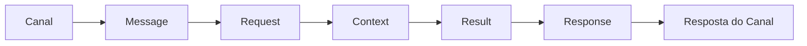

# Message Model

## Objetivo

O Message Model define o conjunto de modelos canônicos utilizados pelo Core do Assist Engine para representar informações durante o processamento de uma requisição.

Seu objetivo é estabelecer uma linguagem comum entre todos os componentes da arquitetura, garantindo que a comunicação ocorra de forma consistente, independente do canal de origem, do provedor de Inteligência Artificial ou do domínio da aplicação.

Os modelos apresentados neste documento representam conceitos arquiteturais e não estruturas específicas de implementação.

---

# Visão Geral

Toda requisição percorre o Assist Engine utilizando um conjunto reduzido de modelos padronizados.

Essa padronização permite que todos os componentes do Core compartilhem a mesma representação dos dados.

---

# Modelos Fundamentais

## Message

Representa a mensagem recebida de um canal de comunicação.

É o primeiro modelo canônico utilizado pelo Assist Engine e elimina diferenças entre plataformas como Web, WhatsApp, Telegram, Instagram ou qualquer outro canal suportado.

A partir desse momento, o Core deixa de conhecer o canal de origem.

---

## Request

Representa a solicitação que será processada pelo Core.

É construída a partir da Message e reúne todas as informações necessárias para o processamento da requisição.

Todos os componentes do Core recebem a mesma representação de Request.

---

## Context

Representa o estado da conversação durante o processamento.

O Context reúne informações relevantes para a tomada de decisão, permitindo que diferentes componentes compartilhem conhecimento sem depender uns dos outros.

Seu conteúdo pode evoluir ao longo do fluxo da requisição.

---

## Result

Representa o resultado produzido por um executor.

Independentemente de a estratégia selecionada utilizar regras, Tools, Inteligência Artificial ou Business Modules, o resultado sempre será representado pelo mesmo modelo.

Esse contrato unifica a saída de todos os executores da arquitetura.

---

## Response

Representa a resposta oficial produzida pelo Core.

É construída exclusivamente pelo Response Builder a partir de um Result e constitui o contrato de saída da arquitetura.

Após sua construção, a Response pode ser convertida para qualquer formato específico de canal pelo Adapter Layer.

---

# Modelos Complementares

Além dos modelos fundamentais, o Assist Engine poderá utilizar modelos auxiliares especializados.

Entre eles:

| Modelo      | Finalidade                                                          |
| ----------- | ------------------------------------------------------------------- |
| Session     | Representação da sessão de conversação.                             |
| Metadata    | Informações adicionais utilizadas durante o processamento.          |
| Attachment  | Representação padronizada de arquivos e mídias.                     |
| ToolCall    | Solicitação de execução de uma Tool.                                |
| ToolResult  | Resultado produzido por uma Tool.                                   |
| MemoryEntry | Representação de informações persistidas na memória conversacional. |

Esses modelos complementam o fluxo principal sem alterar seus contratos fundamentais.

---

# Princípios do Message Model

Todos os modelos do Core devem obedecer aos seguintes princípios:

* independência do canal de comunicação;
* independência do domínio de negócio;
* independência do provedor de IA;
* comunicação por contratos;
* simplicidade e responsabilidade única;
* reutilização entre componentes.

Esses princípios garantem que o modelo permaneça estável mesmo com a evolução da arquitetura.

---

# Evolução do Modelo

Novos modelos poderão ser incorporados ao Assist Engine sempre que representarem um novo conceito arquitetural.

Entretanto, os modelos fundamentais (`Message`, `Request`, `Context`, `Result` e `Response`) constituem a base da comunicação interna do Core e devem permanecer estáveis ao longo da evolução da plataforma.

Alterações nesses modelos exigem avaliação arquitetural, pois podem impactar múltiplos componentes do sistema.

---

# Considerações Finais

O Message Model estabelece uma linguagem comum para toda a arquitetura do Assist Engine.

Ao definir modelos canônicos independentes de tecnologias, canais e implementações específicas, a arquitetura reduz o acoplamento entre seus componentes e simplifica a comunicação ao longo do fluxo de processamento.

Esses modelos constituem a base sobre a qual serão construídos os contratos, as interfaces e as implementações do Core, servindo como referência para toda a evolução da plataforma.
