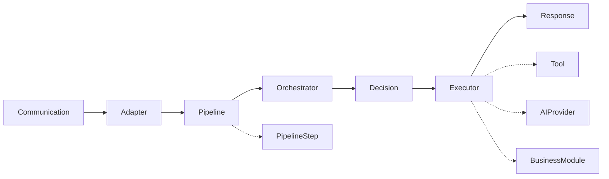

# Extension Points

## Objetivo

O Assist Engine foi projetado para evoluir por extensão, permitindo que novas capacidades sejam incorporadas sem modificar seu Core.

Este documento identifica os principais pontos de extensão da arquitetura e define como novos comportamentos podem ser adicionados preservando os princípios de baixo acoplamento, comunicação por contratos e independência tecnológica.

Cada ponto de extensão representa uma capacidade arquitetural que pode receber novas implementações ao longo da evolução da plataforma.

---

# Visão Geral

A arquitetura disponibiliza diversos pontos de extensão distribuídos ao longo do fluxo de processamento.

Cada extensão é incorporada por meio de contratos definidos pelo Core.

---

# Pipeline Steps

O Pipeline pode ser expandido pela adição de novos Pipeline Steps.

Cada Step representa uma única responsabilidade técnica e participa da preparação da requisição antes de sua entrada no Core.

Exemplos:

* autenticação;
* validação;
* enriquecimento do contexto;
* auditoria;
* métricas.

A inclusão de novos Steps não altera o funcionamento dos demais componentes.

---

# Decision Policies

O Decision Engine pode evoluir pela inclusão de novas políticas de decisão.

Essas políticas definem os critérios utilizados para selecionar a estratégia de execução mais adequada para cada requisição.

Novas políticas podem ser adicionadas sem modificar o mecanismo de coordenação do Core.

---

# Executors

A arquitetura permite incorporar novas estratégias de execução.

Todo novo executor deve implementar o contrato comum definido pelo Core.

Exemplos:

* Rule Engine;
* Tool Engine;
* AI Engine;
* Business Modules;
* futuros executores especializados.

O Orchestrator permanece independente da quantidade ou do tipo de executores existentes.

---

# Tools

Novas capacidades do sistema podem ser disponibilizadas por meio de Tools.

Cada Tool representa uma capacidade específica, encapsulada e reutilizável.

Exemplos:

* consultas em banco de dados;
* envio de e-mails;
* integração com APIs externas;
* geração de documentos;
* processamento de arquivos.

A inclusão de uma nova Tool não exige alterações no Tool Engine.

---

# AI Providers

O Assist Engine suporta múltiplos provedores de Inteligência Artificial.

Cada provedor implementa o contrato definido pelo Core.

Exemplos:

* OpenAI;
* Claude;
* Gemini;
* Ollama;
* futuros provedores.

Essa abordagem permite substituir ou incorporar novos modelos sem modificar o AI Engine.

---

# Business Modules

Os Business Modules representam o principal mecanismo de extensão da aplicação.

Cada módulo encapsula um domínio específico, permanecendo completamente desacoplado do Core.

Exemplos:

* Agenda;
* CRM;
* Financeiro;
* Atendimento;
* Catálogo;
* Estoque.

Novos módulos podem ser adicionados sem alterar a arquitetura do Assist Engine.

---

# Communication Adapters

A arquitetura permite incorporar novos canais de comunicação por meio de novos Adapters.

Exemplos:

* Web;
* WhatsApp;
* Telegram;
* Instagram;
* Discord;
* API;
* CLI.

Cada Adapter converte as mensagens do canal para o modelo canônico definido pelo Core.

---

# Princípios de Extensão

Todo ponto de extensão deve respeitar os seguintes princípios:

* implementar contratos definidos pelo Core;
* possuir responsabilidade única;
* comunicar-se por abstrações;
* preservar a independência do Core;
* evitar dependências circulares;
* não modificar componentes existentes quando uma extensão for suficiente.

Esses princípios garantem que a arquitetura evolua de maneira consistente.

---

# Evolução da Arquitetura

A evolução do Assist Engine deve ocorrer prioritariamente pela criação de novas implementações para pontos de extensão já existentes.

A introdução de um novo ponto de extensão somente deve ocorrer quando uma nova categoria de responsabilidade arquitetural for identificada.

Essa estratégia mantém a arquitetura estável e reduz o crescimento desnecessário da complexidade.

---

# Considerações Finais

Os pontos de extensão representam um dos principais mecanismos de evolução do Assist Engine.

Ao definir claramente onde a arquitetura pode crescer, o projeto reduz a necessidade de modificar o Core sempre que novas capacidades forem incorporadas.

Essa abordagem favorece a reutilização, a independência tecnológica e a evolução incremental da plataforma, permitindo que diferentes aplicações compartilhem a mesma base arquitetural enquanto expandem suas funcionalidades de forma controlada e consistente.
